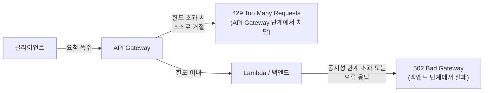

API Gateway에서 발생하는 **429 오류**(Too Many Requests)는 클라이언트(사용자 또는 애플리케이션)가 API에 설정된 요청 속도 제한(Throttling/Rate Limiting)을 초과했을 때 발생하는 오류입니다.

쉽게 비유하면, 1초에 100명의 손님만 받을 수 있는 식당에 200명이 한꺼번에 들이닥쳐서 "잠시만 기다려주세요, 요청이 너무 많습니다"라고 응답하는 상황과 같습니다.

## 왜 발생하는가

- **초당 요청 수(RPS) 초과**: API Gateway의 스테이지(Stage)나 특정 메서드에 설정된 사용량 계획(Usage Plan), 또는 계정 수준의 제한을 넘어선 요청이 들어왔을 때 발생합니다.
- **보호 기제**: 특정 클라이언트가 API를 과도하게 호출해 전체 시스템이 다운되는 것을 막기 위한 AWS의 가드레일(보호 장치)입니다.

## 429 오류와 502 오류의 차이

**[SAP-C02 샘플 문제 10선의 Q4 사례](../../sap-sample-questions/)** 와 비교하면 이해가 빠릅니다.

| 오류 | 발생 위치 | 의미 |
|---|---|---|
| **429 (Too Many Requests)** | API Gateway 자체 | 클라이언트가 요청을 너무 많이 보냄 — API Gateway가 스스로 요청을 거절함 |
| **502 (Bad Gateway)** | API Gateway 뒤의 백엔드 | API Gateway는 정상이나, 연결된 Lambda 함수나 백엔드 서비스가 동시성 제한에 걸리거나 잘못된 응답을 보냄 |

## 해결 전략 — AWS 아키텍처 관점

시험 문제에서 429 오류를 해결하라고 할 때는 보통 다음 전략이 정답으로 제시됩니다.

1. **사용량 계획(Usage Plan) 조정**: 정당한 사용자라면 API 키별로 설정된 한도를 합리적으로 상향 조정합니다.
2. **백오프 및 재시도(Exponential Backoff & Jitter)**: 클라이언트 애플리케이션 측에서 재시도 로직을 구현하되, 짧은 간격으로 계속 호출하지 않고 시간 간격을 점진적으로 늘리며 다시 요청하도록 설계합니다.
3. **캐싱(Caching) 활용**: API Gateway에서 결과를 캐싱해 백엔드까지 요청이 가지 않게 함으로써 부하를 줄입니다.


429와 502는 증상은 비슷해 보여도 **원인 위치가 다릅니다.** 429는 "API Gateway 단계에서 막혔다"는 신호이므로 클라이언트 측 재시도 설계나 Usage Plan 조정이 정답에 가깝고, 502는 "백엔드까지는 도달했지만 처리에 실패했다"는 신호이므로 **[서비스 할당량 자동 증설의 한계와 제어 철학](../service-quotas-limitations/)** 에서 다룬 Lambda 동시성 관리나 SQS 버퍼링이 정답에 가깝습니다. 시험 선지를 읽을 때 이 둘을 혼동하지 않는 것이 핵심입니다.


## 요약


429 오류는 "시스템이 너무 바빠서 더 이상은 못 받겠다"는 거절 신호입니다. 이를 해결하려면 **한도를 합리적으로 조정**하거나, **요청을 분산**(캐싱)하거나, **클라이언트가 똑똑하게 재시도**(Exponential Backoff)하도록 설계하는 것이 AWS가 권장하는 아키텍처 원리입니다.


이 판단을 실제 문제에 적용하는 훈련은 **[자동화 금지 영역 4가지와 판단 체크리스트](../automation-control-boundaries/)** 와 함께 연습하면 효과가 더 큽니다.
