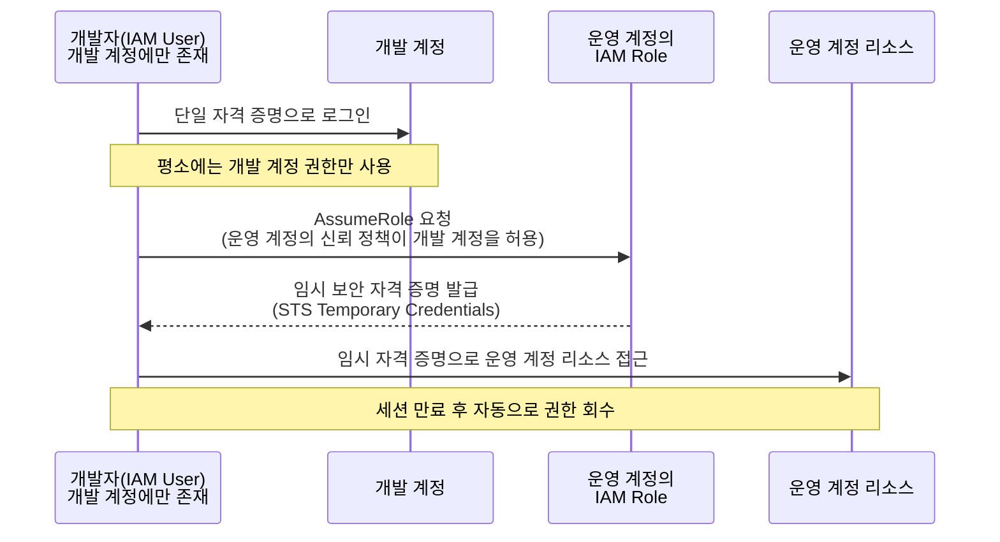

멀티 계정 환경에서 자주 등장하는 요구사항은 **"어떻게 사용자 입장에서 단 하나의 자격 증명(Single Credentials)만으로 필요한 권한을 분리해서 행사할 것인가?"** 입니다. **[SAP-C02 샘플 문제 Q6](../../sap-sample-questions/)** 가 정확히 이 시나리오를 묻습니다. **[Systems Manager Run Command](../ssm-run-command/)** 에서 다룬 IAM Role 기반 신뢰 모델이 여기서는 "계정 간 권한 위임"이라는 형태로 다시 등장합니다.

## 1. 문제의 핵심 요구사항

- **사용자 편의성**: 여러 계정을 오갈 때마다 별도의 ID/PW를 만들고 관리하지 않도록, 단 1개의 자격 증명 세트만 사용해야 합니다.
- **보안성(최소 권한)**: 개발자는 개발 계정에는 접근하지만, 운영 계정에는 직접적이고 상시적인 접근 권한이 없어야 합니다.

이 두 요구사항은 겉보기에 충돌하는 것처럼 보입니다 — "하나의 자격 증명으로 여러 계정을 다루면서도, 그 계정들에 대한 권한은 엄격히 분리하라"는 뜻이기 때문입니다. AWS는 이 충돌을 **AssumeRole** 로 해결합니다.

## 2. 왜 "단일 크리덴셜"이 가능한가 — AssumeRole의 원리

AWS에서 단일 크리덴셜로 멀티 계정을 제어하는 것은 사용자를 물리적으로 각 계정에 생성하는 방식이 아니라, **권한 위임(Delegation)** 을 통해 이루어집니다.

실제로는 4단계로 진행됩니다.

1. **사전 준비(신뢰 정책 설정)**: 운영 계정의 IAM 역할(Role)에 신뢰 정책(Trust Policy)을 설정합니다. 이 정책은 "개발 계정(의 특정 IAM 사용자나 그룹)이 나(운영 계정)의 이 역할을 Assume하는 것을 허용한다"는 일종의 출입증 발행 규칙입니다.
2. **단일 크리덴셜 사용**: 개발자는 자기 계정의 IAM 사용자 정보(자격 증명) 하나로 로그인합니다. 평소 업무는 이 자격 증명만으로 개발 계정에서 처리합니다.
3. **임시 권한 획득(AssumeRole)**: 개발자가 운영 환경 작업이 필요할 때, CLI나 콘솔에서 해당 역할을 호출합니다. AWS는 "개발 계정의 이 사용자가 운영 계정의 역할을 빌려도 되는가?"를 신뢰 정책으로 확인한 뒤, 일시적인 STS 임시 보안 자격 증명(Temporary Security Credentials)을 발급합니다.
4. **격리된 작업**: 개발자는 이 임시 자격 증명으로 운영 환경에서 작업을 수행합니다. 작업이 끝나면 자격 증명은 만료되어 사라지므로, 개발자는 운영 환경에 대한 영구적인 접근 권한을 갖지 않습니다.


AssumeRole로 발급되는 것은 영구 자격 증명이 아니라 **AWS STS(Security Token Service)의 임시 보안 자격 증명**입니다. 세션이 만료되면 권한이 자동으로 회수되므로, "상시적인 접근 권한 없음"이라는 보안 요구사항을 자연스럽게 만족시킵니다.


이 설계의 핵심 포인트는 두 가지로 요약됩니다.

- **관리의 편의성**: 운영 계정에 개발자를 위한 별도의 사용자 계정을 만들 필요가 없습니다 — 계정 관리 오버헤드가 0에 가깝습니다.
- **강력한 보안**: 개발자의 본래 자격 증명은 개발 계정에만 존재합니다. 운영 계정의 권한은 필요할 때만, 일시적으로만 존재하므로 최소 권한 원칙을 그대로 구현합니다.

이 "중앙집중식 자격 증명 + 분산된 권한 위임(AssumeRole)" 방식이 AWS SAP 시험에서 멀티 계정 보안 아키텍처를 묻는 문제의 정답 패턴 그 자체입니다. 이 원리를 파악했다면, 보안 관련 문제에서 "사용자 계정을 여러 계정에 만들라"는 선지는 고민할 필요 없이 바로 소거할 수 있습니다.

## 3. 왜 "다중 자격 증명"은 오답인가

각 계정에 사용자를 물리적으로 생성하는 방식은 다음과 같은 anti-pattern을 만듭니다.

- **관리 오버헤드**: 사용자가 퇴사하거나 비밀번호를 바꿀 때마다 각 계정을 일일이 찾아가서 수정해야 합니다 — 운영 우수성 원칙에 위배됩니다.
- **보안 취약점**: 자격 증명이 여러 계정에 분산되므로 유출 가능성이 커지고, 권한 관리가 복잡해집니다.

| 선지 패턴 | 판정 | 이유 |
|---|---|---|
| 각 계정에 운영자·개발자 IAM 사용자를 개별 생성 | ❌ 오답 | 운영자가 두 세트의 자격 증명을 가져야 함 — "단일 크리덴셜" 요구사항 위배 |
| 다른 계정의 IAM 그룹에 사용자를 직접 추가 | ❌ 오답 | IAM 그룹은 계정 경계를 넘어 사용자를 추가할 수 없음(기술적으로 불가능) |
| 운영 계정에 공유 Role을 만들고 개발 계정을 신뢰 정책에 추가, 개발 계정 사용자가 AssumeRole | ✅ 정답 | 단일 자격 증명 유지 + 운영 계정 권한은 임시·위임 방식으로만 행사 |


역할(Role)은 **리소스가 있는 계정**(이 경우 운영 계정)에 만들어야 합니다. "개발 계정에 운영 권한을 가진 역할을 만든다"는 식의 반대 방향 설계는 신뢰 관계의 방향이 뒤바뀐 오답 패턴입니다.


## 요약


이 시나리오가 묻는 핵심 철학은 **"IAM 사용자는 최소화하고, 권한은 역할(Role)을 통해 위임(Assume)받아라"** 입니다. 멀티 계정 환경에서 운영 오버헤드를 줄이면서 보안을 유지하는 AWS의 일관된 답안지이며, **[도메인 1: 다중 계정 AWS 환경 설계](../../../sap/domain1-organizational-complexity/)** 에서 다룬 Organizations·SCP 거버넌스와 함께 적용되는 가장 기본적인 신뢰 모델입니다.

