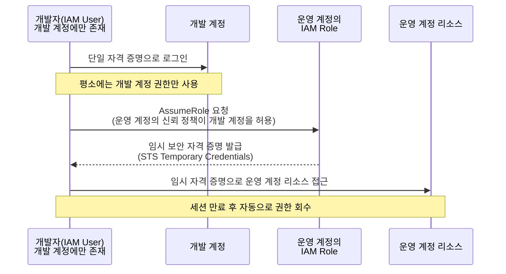

멀티 계정 환경에서 자주 등장하는 요구사항은 **"어떻게 사용자 입장에서 단 하나의 자격 증명(Single Credentials)만으로 필요한 권한을 분리해서 행사할 것인가?"** 입니다. **[SAP-C02 샘플 문제 Q6](../../sap-sample-questions/)** 가 정확히 이 시나리오를 묻습니다. **[Systems Manager Run Command](../ssm-run-command/)** 에서 다룬 IAM Role 기반 신뢰 모델이 여기서는 "계정 간 권한 위임"이라는 형태로 다시 등장합니다.

## 1. 문제의 핵심 요구사항

- **사용자 편의성**: 여러 계정을 오갈 때마다 별도의 ID/PW를 만들고 관리하지 않도록, 단 1개의 자격 증명 세트만 사용해야 합니다.
- **보안성(최소 권한)**: 개발자는 개발 계정에는 접근하지만, 운영 계정에는 직접적이고 상시적인 접근 권한이 없어야 합니다.

이 두 요구사항은 겉보기에 충돌하는 것처럼 보입니다 — "하나의 자격 증명으로 여러 계정을 다루면서도, 그 계정들에 대한 권한은 엄격히 분리하라"는 뜻이기 때문입니다. AWS는 이 충돌을 **AssumeRole** 로 해결합니다.

## 2. 왜 "단일 크리덴셜"이 가능한가 — AssumeRole의 원리

AWS에서 단일 크리덴셜로 멀티 계정을 제어하는 것은 사용자를 물리적으로 각 계정에 생성하는 방식이 아니라, **권한 위임(Delegation)** 을 통해 이루어집니다.

1. **사용자 거점(개발 계정)**: 개발자의 IAM 사용자는 개발 계정에만 존재합니다. 이 사용자는 자신의 고유 자격 증명(Access Key/Secret Key 또는 SSO 로그인) 하나만 사용합니다.
2. **권한 위임(AssumeRole)**: 이 사용자가 운영 계정의 리소스를 건드려야 할 때, 운영 계정에 미리 만들어둔 "운영자 역할(Role)"을 일시적으로 빌려옵니다(Assume). 운영 계정의 역할에는 개발 계정을 신뢰하는 신뢰 정책(Trust Policy)이 미리 설정되어 있어야 합니다.
3. **결과**: 운영 계정 입장에서는 "개발 계정의 특정 사용자에게 임시로 권한을 부여했다"고 판단하므로, 운영 계정에 별도의 사용자를 만들지 않아도 됩니다. 사용자는 단 하나의 자격 증명으로 두 환경을 모두 다룰 수 있습니다.


AssumeRole로 발급되는 것은 영구 자격 증명이 아니라 **AWS STS(Security Token Service)의 임시 보안 자격 증명**입니다. 세션이 만료되면 권한이 자동으로 회수되므로, "상시적인 접근 권한 없음"이라는 보안 요구사항을 자연스럽게 만족시킵니다.


## 3. 왜 "다중 자격 증명"은 오답인가

각 계정에 사용자를 물리적으로 생성하는 방식은 다음과 같은 anti-pattern을 만듭니다.

- **관리 오버헤드**: 사용자가 퇴사하거나 비밀번호를 바꿀 때마다 각 계정을 일일이 찾아가서 수정해야 합니다 — 운영 우수성 원칙에 위배됩니다.
- **보안 취약점**: 자격 증명이 여러 계정에 분산되므로 유출 가능성이 커지고, 권한 관리가 복잡해집니다.

| 선지 패턴 | 판정 | 이유 |
|---|---|---|
| 각 계정에 운영자·개발자 IAM 사용자를 개별 생성 | ❌ 오답 | 운영자가 두 세트의 자격 증명을 가져야 함 — "단일 크리덴셜" 요구사항 위배 |
| 다른 계정의 IAM 그룹에 사용자를 직접 추가 | ❌ 오답 | IAM 그룹은 계정 경계를 넘어 사용자를 추가할 수 없음(기술적으로 불가능) |
| 운영 계정에 공유 Role을 만들고 개발 계정을 신뢰 정책에 추가, 개발 계정 사용자가 AssumeRole | ✅ 정답 | 단일 자격 증명 유지 + 운영 계정 권한은 임시·위임 방식으로만 행사 |


역할(Role)은 **리소스가 있는 계정**(이 경우 운영 계정)에 만들어야 합니다. "개발 계정에 운영 권한을 가진 역할을 만든다"는 식의 반대 방향 설계는 신뢰 관계의 방향이 뒤바뀐 오답 패턴입니다.


## 요약


이 시나리오가 묻는 핵심 철학은 **"IAM 사용자는 최소화하고, 권한은 역할(Role)을 통해 위임(Assume)받아라"** 입니다. 멀티 계정 환경에서 운영 오버헤드를 줄이면서 보안을 유지하는 AWS의 일관된 답안지이며, **[도메인 1: 다중 계정 AWS 환경 설계](../../../sap/domain1-organizational-complexity/)** 에서 다룬 Organizations·SCP 거버넌스와 함께 적용되는 가장 기본적인 신뢰 모델입니다.

