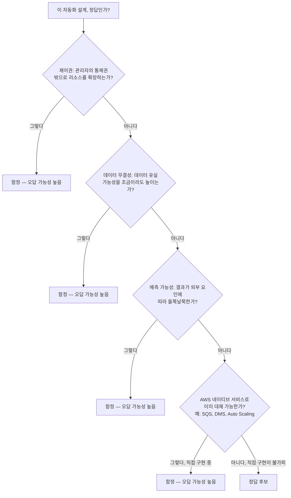

SAP-C02 시험에서는 "이것은 AWS에서 기술적으로 가능하지만, 설계 원칙상 안 되는(혹은 하지 말아야 할) 것"을 찾아내는 것이 합격의 핵심입니다. **[서비스 할당량 자동 증설](../service-quotas-limitations/)** 이 대표 사례 중 하나이고, 이 페이지에서는 그 외에 자주 등장하는 "자동화가 금지되었거나 권장되지 않는 영역" 세 가지와, 어떤 시나리오에서도 적용할 수 있는 판단 체크리스트를 정리합니다.


이 네 가지 영역의 공통점은 모두 **"운영적인 판단이 필요한 영역"**(리소스 확장, 보안 변경, 데이터 무결성, 비용 절감)이라는 점입니다. AWS는 이런 영역을 자동화된 코드가 직접 수행하게 두지 않고, **알림(Alerting)을 통해 사람의 의사결정을 유도**하는 아키텍처를 가장 신뢰합니다.


## 1. 서비스 할당량(Quota)의 수동 관리

API Gateway·Lambda 동시 실행 수 같은 서비스 할당량을 코드로 자동 증설하는 설계는 거의 항상 함정입니다. Service Quotas API는 즉시 변경이 아니라 비동기 승인 요청을 보내는 구조이고, 코드가 스스로 한도를 늘리게 두면 자가 증식형 장애로 이어질 수 있기 때문입니다. 이 사례의 시퀀스 다이어그램과 올바른 해결 아키텍처(SQS 버퍼링, 동시성 제한 최적화, API Gateway Throttling)는 **[서비스 할당량 자동 증설의 한계와 제어 철학](../service-quotas-limitations/)** 에서 깊이 다뤘으니 여기서는 나머지 세 영역에 집중합니다.

## 2. IAM 정책 및 보안 그룹의 "지나친" 자동화

**사례**: EC2 인스턴스가 실행될 때마다 보안 그룹의 인바운드 규칙을 동적으로 자동 수정해 특정 IP를 허용하는 방식.

**이유**: 보안 정책은 예측 가능성이 중요합니다. 자동화가 보안 규칙을 직접 건드리면 감사(Audit)가 불가능해지고, 보안 구멍이 발생할 위험이 커집니다.


**시험 전략**: 특정 접근이 필요하면 보안 그룹을 자동 수정하는 대신, **IAM Role**(최소 권한)이나 **Systems Manager(SSM)** 를 통한 원격 제어로 접근을 통제하는 선지를 찾으세요. SSM Run Command는 인바운드 포트를 열 필요 없이 아웃바운드 HTTPS만으로 작동하므로, "인바운드 443만 허용"같은 엄격한 보안 정책과 충돌하지 않습니다. 이 폴링 구조와 신뢰 모델은 **[Systems Manager Run Command: 접속이 아니라 폴링이다](../ssm-run-command/)** 에서 더 깊이 다룹니다.


이 원칙은 **[도메인 1: 보안 제어 규정](../../../sap/domain1-organizational-complexity/)** 에서 다룬 최소 권한 원칙과 그대로 이어집니다.

## 3. 상태 저장(Stateful) 서비스의 자동화된 마이그레이션·복제

**사례**: 데이터베이스나 파일 시스템의 마이그레이션을 Lambda로 직접 자동화하거나, 실시간 데이터 복제 로직을 직접 구현하는 방식.

**이유**: 데이터 무결성은 AWS가 가장 강조하는 설계 철학입니다. 직접 짠 로직은 네트워크 중단·부분 실패 같은 엣지 케이스를 놓쳐 데이터 손실로 이어질 위험이 큽니다.


**시험 전략**: AWS가 제공하는 전용 마이그레이션·복제 서비스 — **AWS DataSync**, **AWS DMS**, **Amazon Aurora 글로벌 데이터베이스** 등을 활용하는 선지가 정답입니다. "직접 로직을 구현한다"는 선지는 거의 오답입니다. 도구 비교는 **[도메인 4: 마이그레이션·현대화](../../../sap/domain4-migration-modernization/)** 에서 다룹니다.


## 4. 비용 최적화와 자동 삭제

**사례**: "비용이 많이 나오니, 지정된 예산을 초과하면 사용하지 않는 리소스를 자동으로 삭제하라."

**이유**: 운영 중인 서비스가 예고 없이 갑자기 삭제되면 가용성에 치명적인 영향을 줍니다. 비용 절감이 가용성을 희생할 만큼 긴급한 경우는 거의 없습니다.


**시험 전략**: 리소스를 직접 삭제하는 자동화는 위험한 선지입니다. **AWS Budgets 알림(Billing Alarm)** 으로 예산 초과를 알리고, **운영자가 정지(Stop) 또는 적정 규모 조정(Right-sizing)을 결정**하게 하는 것이 AWS의 일관된 정답 경향입니다. 비용 거버넌스 전반은 **[도메인 1: 비용 최적화 및 가시성](../../../sap/domain1-organizational-complexity/)** 을 참고하세요.


## "자동화 금지 영역" 구분을 위한 체크리스트

어떤 자동화 설계를 마주치면 다음 4가지 질문을 순서대로 던져보세요. 하나라도 "그렇다"이면 그 선지는 함정일 가능성이 높습니다.

| 질문 | 의미 |
|---|---|
| **제어권(Control)** | 이 자동화가 관리자의 통제권 밖으로 리소스를 확장하는가? |
| **데이터 무결성(Integrity)** | 이 자동화가 데이터 유실 가능성을 조금이라도 높이는가? |
| **예측 가능성(Predictability)** | 결과가 항상 동일한가, 아니면 외부 요인에 따라 들쭉날쭉한가? |
| **AWS 네이티브 서비스** | 이미 AWS가 제공하는 전용 서비스(SQS, DMS, Auto Scaling 등)로 대체 가능한가? |

## 요약


AWS는 **"운영적인 판단이 필요한 영역"**(리소스 확장, 비용 절감, 보안 변경)은 자동화된 코드가 직접 수행하게 두지 않습니다. 시험 선지에서 "자동으로 ~한다"가 제어·데이터·보안 영역을 건드린다면, 그 선지를 먼저 의심하세요.


이 판단 기준을 실제 문제에 적용하는 훈련은 **[실전 문제 풀이 기술](../../real-exam-tactics/)** 의 키워드 매핑·오답 역추적 방법, 그리고 **[SAP-C02 샘플 문제 10선](../../sap-sample-questions/)** 과 함께 연습하면 효과가 더 큽니다.
