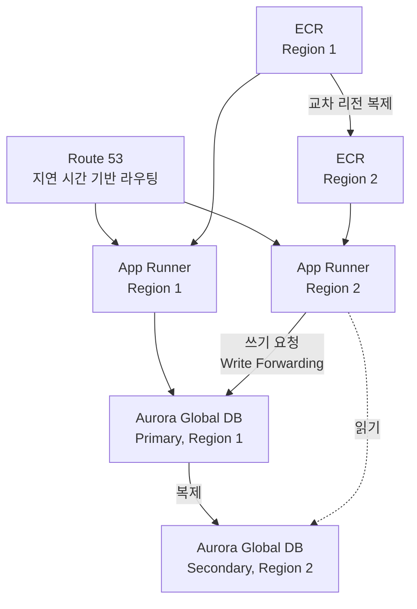

**[SAP-C02 샘플 문제 Q9](../../sap-sample-questions/)** 는 "최소한의 변경(LEAST change)으로 기존 아키텍처를 액티브-액티브(Active-Active)로 확장하라"는 요구사항을 다룹니다. "최소한의 변경"이라는 키워드가 왜 특정 선지를 정답으로 만드는지를 이해하면, 비슷한 유형의 문제 전체를 관통하는 원리를 잡을 수 있습니다.

## 1. 운영 우수성(Operational Excellence)의 핵심 원칙과 연결

운영 우수성 기둥은 다음 두 원칙을 강조합니다.

- **변경의 위험 완화**: "변경을 작게, 자주 하라"는 권장은 변경으로 인한 예기치 않은 오류 가능성을 줄이려는 목적입니다. 즉, 불필요하거나 과도한 변경은 시스템의 **예측 가능성(Predictability)** 을 떨어뜨립니다.
- **운영 오버헤드 최소화**: 레거시를 무리하게 다른 서비스로 마이그레이션(예: 데이터베이스 엔진 자체를 교체)하면 운영 팀에 새로운 학습 비용과 관리 부담이 생깁니다. 기존 시스템의 특성을 최대한 유지하며 확장하는 것이 운영 측면에서 가장 안전합니다.

## 2. 다른 기둥들과의 복합적 관계

"변경의 최소화"를 선택할 때는 운영 우수성 하나만이 아니라 다른 기둥과도 함께 연결됩니다.

- **신뢰성(Reliability)**: 기존에 검증된 DB 구조를 그대로 사용하면서 글로벌 확장만 하는 것은, 새로운 서비스를 도입하는 것보다 장애 위험이 훨씬 적습니다.
- **비용 최적화(Cost Optimization)**: 전체 아키텍처를 새로 짜는 것은 마이그레이션 비용과 개발 시간을 고려할 때, 가장 적은 비용으로 가장 큰 효과(ROI)를 내는 선택이 아닐 수 있습니다.


시험에서 이런 질문을 받으면 다음 두 가지로 분해해서 생각하세요. "운영의 복잡성을 줄여라"는 **운영 우수성**, "변경으로 인한 위험을 줄여라"는 **신뢰성**의 신호입니다. "최소한의 변경"을 묻는 문제는 대부분 이 두 기둥의 조합으로 정답을 찾습니다.


## 3. Q9 시나리오 분석 — AWS 서비스 관점

App Runner 기반 애플리케이션과 Aurora MySQL을 사용하는 서비스를 두 리전에서 액티브-액티브로 운영해야 하는 시나리오입니다.

### 컴퓨팅·라우팅 확장

- **Route 53 지연 시간 기반 라우팅**: 이미 도메인이 등록되어 있으므로, Route 53의 지연 시간 기반 라우팅(Latency-based Routing)을 사용하면 사용자와 가장 가까운 리전의 App Runner로 자연스럽게 트래픽을 분산할 수 있습니다.
- **ECR 교차 리전 복제**: 서로 다른 리전에 App Runner를 띄우려면 해당 리전의 ECR(이미지 저장소)에도 컨테이너 이미지가 있어야 합니다. 교차 리전 복제(Cross-Region Replication)를 켜두면 이미지가 자동으로 동기화되어, 운영자가 일일이 이미지를 올릴 필요가 없습니다.

### 데이터베이스 확장 — Aurora Global Database

액티브-액티브 환경에서는 데이터베이스가 양쪽 리전에서의 쓰기(Write)를 처리할 수 있어야 합니다. **Aurora 글로벌 데이터베이스**의 **쓰기 전달(Write Forwarding)** 기능을 활성화하면, 보조 리전에서 들어온 쓰기 요청을 주 리전으로 자동 전달해 데이터 정합성을 유지하면서도 액티브-액티브처럼 운영할 수 있습니다.

## 4. 왜 DynamoDB 글로벌 테이블은 함정인가

이 문제의 함정은 "DynamoDB 글로벌 테이블로 전환"하는 선지입니다. DynamoDB가 글로벌 확장성에 훨씬 강력한 서비스인 것은 맞지만, 기존에 Aurora MySQL을 쓰고 있는데 이를 DynamoDB로 바꾸는 것은 데이터베이스 구조 전체를 새로 설계해야 하는 **마이그레이션 수준의 큰 변경**입니다. 반면 Aurora 글로벌 데이터베이스는 기존 DB의 특성을 그대로 유지하면서 리전만 확장하는 것이라 "최소한의 변경"이라는 요구사항에 훨씬 더 부합합니다.

| 선지 패턴 | 판정 | 이유 |
|---|---|---|
| MySQL 데이터를 DynamoDB 글로벌 테이블로 전환 | ❌ 오답 | 기능은 우수하지만 데이터 모델 전체를 재설계해야 하는 대규모 변경 |
| App Runner 설정에 두 번째 배포 타깃 직접 추가 | ❌ 오답 | App Runner는 그런 멀티 리전 배포 타깃 설정 기능을 제공하지 않음 |
| ECR 교차 리전 복제 + 두 번째 리전에 App Runner 배포 + Route 53 지연 시간 기반 라우팅 | ✅ 정답(A, D) | 기존 컨테이너·배포 구조를 그대로 유지하며 리전만 추가 |
| Aurora 글로벌 데이터베이스 + Write Forwarding | ✅ 정답(F) | 기존 Aurora MySQL 구조를 유지하며 리전만 확장 |

## 요약


"더 강력한 서비스"와 "더 적은 변경"은 다른 축입니다. DynamoDB가 기술적으로 더 매력적으로 보여도, 문제가 "LEAST change"를 명시했다면 **기존 아키텍처의 특성을 유지한 채 확장하는 선지**가 항상 우선입니다.


이 원리는 **[Well-Architected: 운영 우수성](../../../well-architected/operational-excellence/)**, **[Well-Architected: 신뢰성](../../../well-architected/reliability-pillar/)**, **[Well-Architected: 비용 최적화](../../../well-architected/cost-optimization-pillar/)** 세 기둥이 동시에 작용하는 대표적인 사례입니다. "운영 오버헤드 최소화"만 다룬 **[운영 우수성 관점의 현대화 원리](../operational-excellence-modernization/)** 와 비교하면, 이번 사례는 "현대화"가 아니라 "확장" 상황에서는 오히려 변경을 최소화하는 쪽이 정답이 된다는 대조를 보여줍니다.
