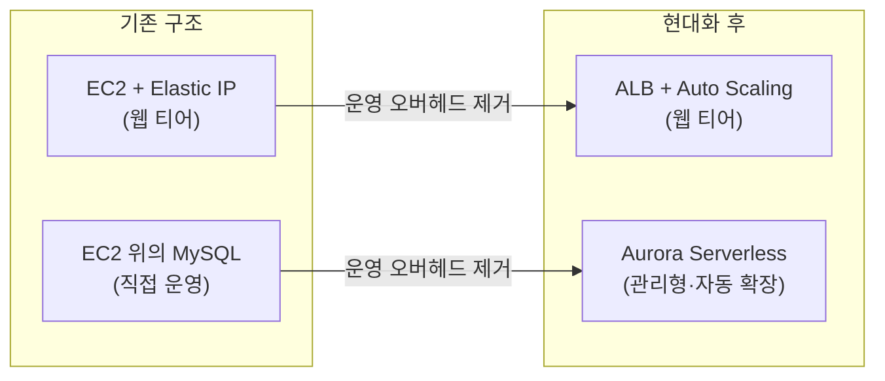

**[SAP-C02 샘플 문제 Q10](../../sap-sample-questions/)** 은 레거시 환경을 클라우드 네이티브로 **현대화(Modernization)** 함과 동시에 **운영 오버헤드를 최소화**하라는 명확한 목표를 가지고 있습니다. 이 시나리오를 풀어보면, SAP 시험 전반에 반복되는 "운영 우수성(Operational Excellence)" 판단 원리가 그대로 드러납니다.

## 시나리오 요약

Windows 웹 티어가 Elastic IP를 직접 붙인 EC2에서, Linux 애플리케이션 티어가 ALB 뒤에서, MySQL이 별도 Linux EC2에서 각각 운영되고 있는 멀티 티어 구조입니다. 모든 인스턴스는 x86 기반입니다. 이 환경에서 운영 오버헤드를 최소화하며 성능을 개선해야 합니다.

## 1. 웹 티어: EC2 직접 운영에서 ALB 활용으로

**문제점**: 웹 티어가 개별 EC2에 Elastic IP를 직접 붙여서 운영되고 있습니다. 이는 개별 인스턴스에 대한 의존성이 높고, 확장성(Auto Scaling)과 가용성을 확보하기 어렵습니다.

**해결책**: 웹 티어를 ALB(Application Load Balancer) 뒤로 배치합니다.

**효과**: 서버가 추가·삭제되어도 사용자는 동일한 엔드포인트로 접속할 수 있고, Auto Scaling으로 트래픽을 자동 처리할 수 있어 고가용성과 운영 효율성이 크게 향상됩니다.

## 2. 데이터베이스: 직접 운영에서 서버리스 전환으로

**문제점**: MySQL이 별도의 Linux EC2 인스턴스에서 구동 중입니다. 패치, 백업, 복제, 스케일링을 모두 직접 운영해야 하는 높은 운영 부담을 의미합니다.

**해결책**: Amazon Aurora Serverless로 마이그레이션합니다.

**효과**: 관리형 서비스로 전환하면 패치·백업 같은 인프라 관리 업무가 AWS로 이관됩니다. 서버리스이므로 워크로드 변화에 따라 용량이 자동 조정되어 비용 최적화와 성능 향상을 동시에 잡을 수 있습니다.

## SAP 시험의 관점: 운영 우수성(Operational Excellence)

시험 문제에서 **"운영 오버헤드를 최소화하라(minimize operational overhead)"** 라는 문구가 나오면, 항상 다음 두 가지를 먼저 떠올리세요.

1. **관리형 서비스(Managed Service) 우선**: 직접 관리하는 EC2 기반 솔루션보다는 RDS, Aurora, SQS, SNS 같은 관리형 서비스로 대체합니다.
2. **서버리스(Serverless) 우선**: 서버 자체를 직접 관리하지 않아도 되는 서비스(Lambda, Fargate, Aurora Serverless)가 있다면 그것이 1순위 정답입니다.

이 우선순위는 **[자동화 금지 영역의 체크리스트](../automation-control-boundaries/)** 에서 본 "AWS 네이티브 서비스로 이미 대체 가능한가?"라는 질문과 같은 맥락입니다 — 직접 운영하는 것보다 AWS가 관리하는 서비스를 우선하라는 원칙이 반복해서 등장합니다.

### 함정 피하기

| 선지 패턴 | 판정 | 이유 |
|---|---|---|
| 데이터베이스를 여러 EC2에 수동으로 분산 | ❌ 오답 | 패치할 서버가 늘어나 운영 오버헤드를 오히려 키우는 행위 |
| x86에서 Graviton2로 인스턴스 유형만 전환 | ❌ 오답 | 성능 향상은 있지만 운영 오버헤드 최소화라는 목표와는 무관한 하드웨어 교체일 뿐이며, Windows 인스턴스는 Graviton을 지원하지 않는 기술적 제약도 있음 |
| 웹 티어를 ALB 뒤로 배치 | ✅ 정답 | 계층 분리 + Auto Scaling으로 가용성·운영 효율성 확보 |
| MySQL을 Aurora Serverless로 마이그레이션 | ✅ 정답 | 관리형·서버리스 전환으로 패치·백업·스케일링 부담 제거 |


"성능이 좋아 보이는" 선지(예: 더 강력한 인스턴스 유형, 하드웨어 아키텍처 교체)와 "운영 부담을 줄이는" 선지를 혼동하지 마세요. 문제가 "운영 오버헤드 최소화"를 명시했다면, 정답은 항상 **관리형·서버리스로의 전환** 쪽입니다.


## 요약


ALB를 통한 계층 분리와 데이터베이스의 서버리스 전환은 AWS Modernization의 정석입니다. 두 선택 모두 "직접 운영하던 책임을 AWS 관리형 서비스로 이관한다"는 동일한 원리를 따르며, 이는 **[도메인 4: 현대화 및 개선 기회 파악](../../../sap/domain4-migration-modernization/)** 에서 다룬 현대화 전략, 그리고 **[Well-Architected: 운영 우수성](../../../well-architected/operational-excellence/)** 의 핵심 원칙과 그대로 이어집니다.

