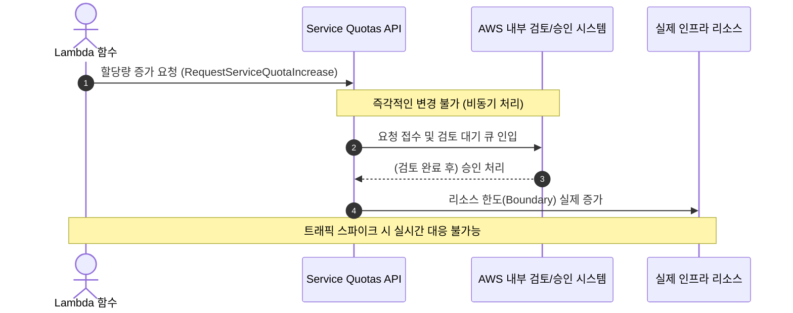
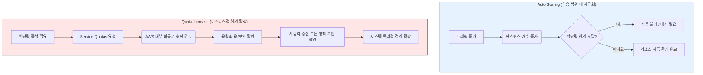
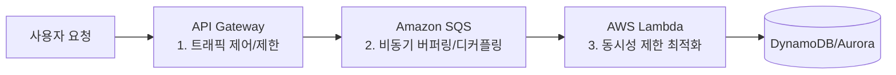

AWS의 서비스 할당량(Quota)을 Lambda 함수를 사용하여 실시간으로 자동으로 증가시키는 것은 기본적으로 불가능합니다. 

이 문서에서는 왜 이러한 제약이 존재하는지, 그 뒤에 숨겨진 AWS의 설계 철학과 올바른 아키텍처적 해결 방안에 대해 정리합니다.

---

## 1. 실시간 자동 할당량 증설이 불가능한 이유

코드(Lambda 등)를 사용하여 Service Quotas를 실시간으로 직접 제어할 수 없는 핵심 이유는 다음과 같습니다.

### API 설계의 목적 (비동기 승인 모델)
AWS의 Service Quotas API는 할당량 증가를 **요청(Request)**하는 기능이지, 즉시 할당량을 **변경(Modify/Increase)**하는 권한을 제공하지 않습니다. 즉, API를 호출해도 실제로는 할당량 증가 요청이 접수되어 승인을 기다리는 프로세스가 진행될 뿐, 시스템이 즉각적으로 늘어나지 않습니다.

### 보안 및 정책 (자가 증식형 장애 방지)
클라우드 인프라의 주요 자원 제한을 코드 한 줄로 무제한 늘릴 수 있게 한다면, 악의적인 공격자가 시스템의 자원 한도를 순식간에 높여 비용을 폭증시키거나 보안 설정을 무력화할 위험이 있습니다.

---

## 2. AWS의 핵심 설계 철학

AWS가 서비스 할당량(Quota)을 코드(Lambda 등)로 직접 변경할 수 없게 설계한 것에는 다음과 같은 핵심 설계 철학이 담겨 있습니다.

### ① "가드레일(Guardrails)"을 통한 제어권 보호
AWS는 대규모 인프라를 운영하면서 **의도하지 않은 리소스 급증(Runaway processes)**을 가장 경계합니다. 
만약 코드가 스스로 할당량을 늘릴 수 있다면, 특정 버그나 공격에 의해 시스템이 무한정 리소스를 소모하게 되는 **자가 증식형 장애**가 발생할 수 있습니다.

따라서 리소스 확장이라는 권한은 사람이 직접 결정하거나, 최소한 관리자 권한을 가진 중앙 관리 시스템(Service Quotas)을 통하도록 강제하여 사고 시 즉각적인 회수(Rollback)가 가능하도록 통제권을 분리해둔 것입니다.

### ② "오토스케일링(Auto Scaling)" vs "할당량 증설(Quota Increase)"의 구분
AWS는 이 두 가지 영역을 명확하게 분리하여 통제합니다.

*   **Auto Scaling (허용된 범위 내 자동화):** 애플리케이션 수준의 부하 분산은 Auto Scaling Group이나 Lambda Concurrency가 자동으로 처리합니다. 이는 설계 범위 내에서 **성능을 최적화**하기 위한 자동화입니다.
*   **Quota Increase (비즈니스적 결정):** 할당량을 늘리는 것은 서비스의 **한계를 확장**하는 행위입니다. 이는 단순한 기술적 처리가 아니라 비용, 가용성, 인프라 계획이 모두 결합된 비즈니스적 의사결정입니다. AWS는 이를 사람이 직접 검토하거나, 서비스 차원에서 비동기적인 승인 프로세스를 거치도록 하여 운영의 안정성을 보장합니다.

### ③ "아키텍처 중심의 해결(Architecture-first)" 원칙
Well-Architected Framework의 관점에서 **"할당량이 부족하면 무조건 늘려라"**는 가장 나쁜(Worst) 해결책입니다.

대신 아래와 같이 문제를 해결할 수 없는지 먼저 자문해야 합니다.
> *"왜 할당량에 도달했는가? 부하를 버퍼링(SQS)하거나, 로직을 분산하거나, 동시성 설정을 최적화할 수는 없는가?"*

즉, 자동화된 '편법'을 쓰기 전에 Well-Architected Framework에 기반한 **구조적 개선**을 먼저 수행하라는 것이 AWS의 철학입니다.

---

## 3. 올바른 아키텍처적 해결 방안

실제 트래픽 스파이크로 인해 502(Bad Gateway) 등 병목 현상이 발생했을 때 권장되는 아키텍처 개선 방안입니다.

1.  **동시성 제한 최적화 (Concurrency Management):**
    Lambda의 동시성 설정을 관리하여 특정 함수가 계정 내의 전체 리소스(자원)를 독점하거나 고갈시키지 않게 조절합니다.
2.  **트래픽 분산 및 버퍼링 (Decoupling):**
    Amazon SQS 같은 메시지 대기열을 도입하여 요청을 비동기적으로 처리함으로써 피크 타임의 트래픽 급증 부하를 큐에 저장해 두고 안전하게 소화하도록 합니다.
3.  **정상적인 요청 제한 (Throttling):**
    API Gateway 수준에서 처리량 제한(Throttling)을 적절하게 설정하여 백엔드 시스템 전체의 가용성과 안정성을 방어합니다.

---

## 💡 요약 및 시험 적용 요령

AWS가 자동화를 거부하는 것이 아니라, **"시스템의 경계(Boundary)를 확장하는 행위는 사람이 통제하고 설계해야 한다"**는 원칙을 고수하는 것입니다.

이런 관점에서 볼 때, SAP 시험 문제에서 **코드를 통한 자동 증설**을 답으로 선택하는 순간 오답이 되는 이유가 명확해집니다. AWS는 아키텍트에게 '코드로 해결할 영역'과 '아키텍처로 해결할 영역'을 명확히 구분할 것을 요구하고 있습니다. 
시험 문제를 푸실 때 "이건 너무 편법적인 자동화가 아닐까?" 하는 느낌이 든다면, 그것은 높은 확률로 AWS가 설계해 둔 오답 함정(Trap)입니다.
