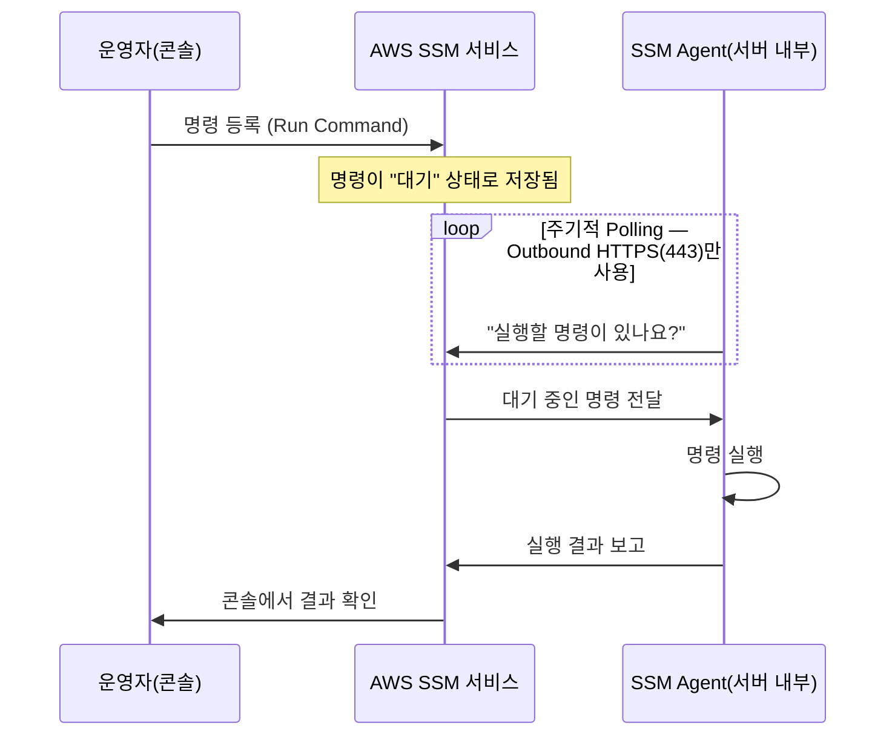

**AWS Systems Manager Run Command**는 대화형 SSH·RDP 연결 없이도 EC2·온프레미스 서버를 안전하게 관리하고 명령을 실행할 수 있게 해주는 도구입니다. **[SAP-C02 샘플 문제 Q5](../../sap-sample-questions/)** 의 정답이 바로 이 서비스이며, **[자동화 금지 영역](../automation-control-boundaries/)** 에서 "보안 그룹을 자동으로 수정하는 대신 SSM으로 원격 제어하라"고 언급한 내용을 이 페이지에서 더 깊게 다룹니다.

많은 사람이 "원격 관리"라는 말 때문에 "인바운드 접속"을 떠올리지만, SSM Run Command는 아키텍처적으로 **'접속(Connection)'이 아니라 '작업 요청(Task Polling)'** 방식으로 동작합니다. 이 차이를 이해하면 SAP 시험의 보안 아키텍처 문제 대부분을 관통하는 원리를 잡을 수 있습니다.

## 1. 왜 Run Command를 쓰는가

- **보안 강화(Zero Inbound Access)**: 서버를 관리하려면 보통 SSH(22번)나 RDP(3389번) 포트를 열어야 합니다. Run Command를 쓰면 인바운드 포트를 열 필요가 없습니다 — 서버에서 AWS로 나가는(Outbound) HTTPS 통신만 허용하면 되므로 보안 그룹 규칙을 매우 엄격하게 유지할 수 있습니다.
- **중앙 집중식 운영 관리**: 여러 인스턴스에 명령을 한 번에 보낼 수 있습니다. 100대 서버에 동시에 패치를 적용하거나 로그를 수집할 때 일일이 접속할 필요가 없습니다.
- **감사 및 규정 준수**: 누가, 언제, 무엇을 실행했고 결과가 무엇인지 AWS CloudTrail과 SSM 콘솔에 모두 기록되어 추적이 가능합니다.

## 2. 작동 원리 — 서버가 먼저 말을 건다

전통적인 SSH·RDP는 운영자가 서버의 포트로 **직접 찔러 들어가는(Inbound)** 방식입니다. 서버는 외부 요청을 항상 대기(Listen)하고 있어야 합니다. SSM Run Command는 반대로 **서버 내부에서 먼저 AWS로 말을 거는** 방식입니다.

운영자가 명령을 "내리는" 주체는 콘솔이지만, 그 명령을 서버 내부로 가져오는 주체는 **서버 안의 SSM Agent**입니다. 서버는 외부의 누구에게도 직접 연결을 허용하지 않고, 자신이 신뢰하는 AWS SSM 서비스와만 아웃바운드로 대화합니다.


**비유**: 전통적인 SSH는 누군가 문을 두드릴 때마다 열어줘야 하는 방식입니다. SSM Run Command는 집주인이 우체국(AWS SSM)에 가서 "나한테 온 편지 없나요?"라고 직접 물어보고 가져오는 방식입니다. 집주인이 신뢰하는 우체국 외에는 누구도 집주인과 직접 대화할 기회가 없습니다.


## 3. 신뢰의 근거 — IAM Role

서버와 AWS SSM 서비스 사이의 신뢰는 **IAM Role**로 맺어집니다. EC2가 이 역할을 가진 SSM Agent를 실행함으로써 "나는 이 계정의 인스턴스이고, 명령을 받을 권한이 있다"는 것을 AWS에 증명합니다. 콘솔에서 명령을 내리는 운영자가 누구인지, 어디서 접속하는지는 보안 그룹 차원에서 전혀 중요하지 않습니다 — 오직 신뢰하는 AWS SSM 시스템을 거쳐 명령이 전달되기 때문입니다.

| 항목 | 전통적 SSH·RDP | SSM Run Command |
|---|---|---|
| 연결 방향 | 운영자 → 서버 (Inbound) | 서버 → AWS (Outbound) |
| 필요한 포트 | 22/3389 인바운드 개방 | 인바운드 불필요, 443 아웃바운드만 |
| 공인 IP | 보통 필요 | 불필요 — 프라이빗 서브넷에서도 관리 가능 |
| 신뢰 근거 | SSH 키 페어 | IAM Role |
| 감사 | 접속 기록만 남음 | 명령·결과 전부 CloudTrail·SSM에 기록 |

## 4. SAP 시험 함정 패턴

"보안을 강화하면서 서버를 관리해야 한다" 또는 "SSH 포트를 열지 말라"는 지문이 나오면, 거의 예외 없이 **Systems Manager Run Command** 가 정답입니다.

| 선지 패턴 | 판정 | 이유 |
|---|---|---|
| SSH 포트를 임시로 연다 | ❌ 오답 | 인바운드 차단 요구사항에 정면으로 위배 |
| SSH 포트 번호를 2222로 바꾼다 | ❌ 오답 | 포트만 바뀔 뿐 인바운드 자체는 여전히 열려 있어 보안 관점에서 의미 없음 |
| Trusted Advisor로 명령을 내린다 | ❌ 오답 | Trusted Advisor는 모니터링·권고 도구일 뿐 원격 명령 실행 기능이 없음 |
| SSH Key Pair 없이 인스턴스를 시작하고 Systems Manager Run Command로 관리한다 | ✅ 정답 | 공격 표면(SSH 키 탈취·브루트포스) 자체를 제거하면서 운영 통제권은 유지 |


**SSH Key Pair를 만들지 않는 것**은 서버를 고립시키는 것이 아니라, "직접 접속이라는 낡고 위험한 방식을 버리고 안전한 AWS 관리형 통로로만 통신하겠다"는 보안 정책의 선언입니다. 키 페어를 생성하지 않으면 키 탈취·브루트포스 공격 시도 자체가 원천적으로 불가능해집니다(Attack Surface Reduction).


## 요약


Run Command는 서버의 입구(Inbound Port)를 열지 않고, 서버가 AWS 중앙 시스템과 대화(Outbound HTTPS)하게 해서 **운영자의 통제권은 높이되 보안 리스크는 없애는** 관리 방식입니다. "포트를 열어야 접속할 수 있다"는 직관을 깨는 것이 이 영역 문제를 푸는 핵심입니다.


이 신뢰 관계(IAM Role 기반 통신) 개념은 다른 서비스를 공부할 때도 "이 서비스가 누구와 어떤 방향으로 신뢰 관계를 맺고 통신하는가"를 파악하는 틀로 그대로 적용할 수 있습니다. **[도메인 1: 보안 제어 규정](../../../sap/domain1-organizational-complexity/)** 의 IAM·KMS 키 정책도 같은 신뢰 모델 위에서 동작합니다.
