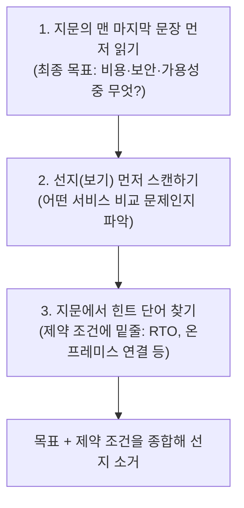

**[Practice Exam 전략](../practice-exam-strategy/)** 에서는 "매주 무엇을 해야 하는가"를 다뤘습니다. 이 페이지는 한 단계 더 들어가, 한 문제를 실제로 풀어내는 그 순간의 기술 — 오답을 어떻게 분석해야 다음 문제에 적용 가능한 패턴이 남는지, 긴 지문을 시간 안에 어떻게 읽는지, 문제집을 몇 회독해야 효율적인지를 다룹니다.


AWS SAP 시험은 **'지식 확인 시험'이 아니라 '의사결정 시뮬레이션 게임'** 에 가깝습니다. 문제집과 오답 분석을 통해 "AWS가 원하는 사고 회로"를 체화하고, 오답 선지를 빠르게 소거하는 훈련이 가장 확실한 지름길입니다.


## 1. 오답 분석에서 반드시 챙겨야 할 두 가지

문제 풀이 중심의 학습에서 가장 중요한 것은 "내가 왜 틀렸는가"와 "출제자가 판 함정이 무엇인가"를 구별하는 것입니다.

### 키워드 매핑 매트릭스 만들기

AWS SAP 시험은 특정 단어가 정답을 거의 결정짓는 경우가 많습니다. **[Practice Exam 전략의 키워드 표](../practice-exam-strategy/)** 에 나온 항목 외에도, 오답 분석을 하면서 본인만의 매트릭스를 계속 누적해 나가는 것이 핵심입니다.

| 지문의 키워드 | 시사하는 정답 방향 |
|---|---|
| "가장 저렴한(most cost-effective)" | 기능이 조금 부족해도 가격이 더 싼 서비스 — 성능 최강 옵션을 정답으로 고르면 함정 |
| "가장 운영 오버헤드가 적은(least operational overhead)" | 거의 예외 없이 관리가 필요 없는 Serverless(Lambda, Fargate, 완전관리형 서비스) |
| "최소한의 코드 변경(minimal code change)" | Replatform류 솔루션 — 관리형 서비스로 교체는 가능하나 재작성은 안 됨 |
| "규정 준수(compliance)" | 암호화·리전 제한·감사 로깅이 강제되는 옵션 우선 |

새로운 문제를 틀릴 때마다 "이 문제의 결정적 키워드는 무엇이었는가"를 한 줄로 적어 이 표에 계속 추가하세요. 회차가 쌓일수록 이 표 자체가 가장 강력한 복습 자료가 됩니다.

### 해설의 논리 검증 — 오답을 역추적하기

단순히 답안지의 "A가 정답입니다"만 보고 넘어가지 마세요. **"왜 B, C, D는 오답인가?"** 를 하나하나 역으로 추적해야, 같은 개념을 다른 시나리오로 비틀어 낸 변형 문제에 속지 않습니다.


"A가 정답이다"라는 결과만 외우면, 다음 시험에서 지문의 제약 조건이 살짝 바뀌어 정답이 B로 뒤집히는 변형 문제에 그대로 틀립니다. 오답 분석의 목적은 정답을 외우는 것이 아니라, **선지 4개 각각이 어떤 조건에서는 정답이 되고 어떤 조건에서는 오답이 되는지**의 경계선을 이해하는 것입니다.


## 2. 긴 지문 대응 — 스키밍(Skimming) 기술

시험장에서는 시간이 절대적으로 부족합니다. 지문을 처음부터 끝까지 다 읽고 생각하면 시간이 모자랍니다. 다음 순서로 읽는 훈련을 권장합니다.

1. **지문의 맨 마지막 문장 먼저 읽기**: "결국 이 문제에서 요구하는 최종 목표(비용 절감, 보안, 가용성 등)가 무엇인가?"를 가장 먼저 파악합니다.
2. **선지(보기) 먼저 스캔하기**: 보기들을 먼저 보면 이 문제가 어떤 서비스 비교를 묻는지 감이 잡힙니다 (예: Direct Connect vs VPN, Aurora vs DynamoDB).
3. **지문에서 힌트 단어 찾기**: 목표와 보기를 머릿속에 둔 상태에서 지문을 위에서부터 훑으며 핵심 제약 조건(예: "RTO 15분 이내", "온프레미스 연결 필요")에 밑줄을 그어가며 읽습니다.


이 순서가 직관에 반대로 느껴질 수 있지만, "목표와 선지를 먼저 알고 지문을 읽는" 것과 "지문을 다 읽고서야 무엇을 묻는지 아는" 것은 같은 지문이라도 읽는 속도가 크게 다릅니다. Practice Exam을 풀 때마다 이 순서를 의식적으로 적용해보고, 익숙해질 때까지 반복하세요.


## 3. 효율적인 2~3회독 전략

문제집이나 덤프 자료를 풀 때는 한 번에 완벽하게 풀려고 하지 말고, 회차마다 목적을 다르게 잡는 것이 효율적입니다.

| 회독 | 목적 | 하지 말아야 할 것 |
|---|---|---|
| 1회독 | **패턴 파악** — "이런 식으로 문제를 내는구나"를 느끼며 출제 의도와 해설을 이해 | 정답률에 집착하기 |
| 2회독 | **오답 스크리닝** — 직접 풀고 틀린 문제만 별도로 표시(오답 노트화) | 맞힌 문제를 다시 들여다보며 시간 쓰기 |
| 3회독 | **속도·논리 점검** — 틀렸던 문제만 다시 풀며 3초 안에 오답 선지를 제거할 수 있는지 테스트 | 답을 외워서 "풀었다"고 착각하기 |

이 3회독 흐름은 **[Practice Exam 전략](../practice-exam-strategy/)** 에서 설명한 "같은 세트를 반복 풀어 점수를 올리는 것은 의미 없다"는 원칙과 모순되지 않습니다 — 2~3회독은 같은 회차 안에서 짧은 간격으로 회독 목적을 다르게 잡는 것이고, 매주 루틴의 Practice Exam은 매번 새로운 세트로 진행하는 것이 원칙입니다.

## 한 줄 요약


AWS SAP 시험은 지식을 확인하는 시험이 아니라 **의사결정 시뮬레이션 게임**입니다. 문제집을 통해 "AWS가 원하는 사고 회로"를 체화하고, 키워드 매핑과 오답 역추적으로 선지를 소거해 나가는 훈련이 가장 확실한 지름길입니다.


이 기술들을 다음 Practice Exam 회차부터 바로 적용해보세요. 어떤 자료로 연습해야 하는지는 **[추천 학습 자료](../recommended-resources/)** 를 참고하세요.
