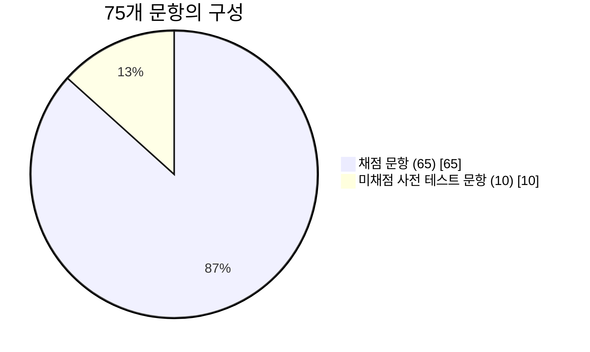
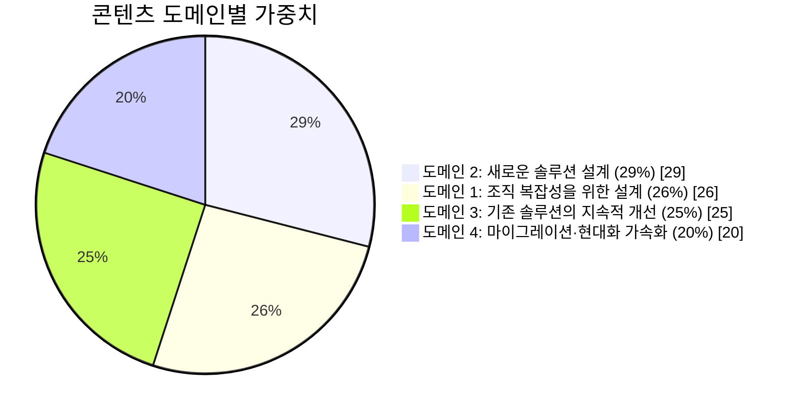
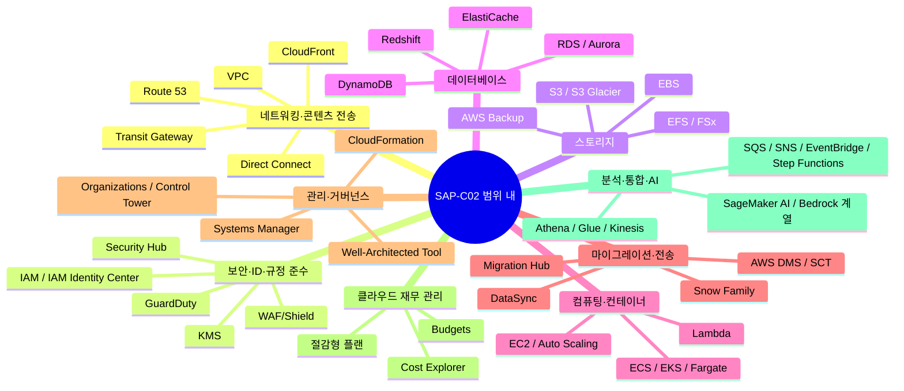

이 페이지는 AWS 공식 **"시험 안내서(SAP-C02)"** 의 내용을 그대로 옮기지 않고, 이 로드맵의 구조에 맞춰 도식과 표로 재구성한 것입니다. 시험을 "암기 목록"이 아니라 "4개의 도메인, 각 도메인 안의 작업(Task), 그 작업이 요구하는 지식/기술"이라는 위계로 먼저 이해하면, 이후 어떤 자료를 보든 그 내용이 어느 좌표에 들어가는지 바로 알 수 있습니다.


시험 시간·문항 수·합격 기준 같은 기본 정보는 **[SAP-C02 시험 개요](../sap-exam-overview/)** 에서 이미 다뤘습니다. 이 페이지는 그보다 한 단계 더 들어가 "실제로 무엇을 평가하는가"에 집중합니다.


## 누가, 무엇을 검증받는가

대상 응시자는 **AWS 서비스로 클라우드 솔루션을 설계·구현한 경력이 2년 이상**인 사람입니다. 단순히 서비스 스펙을 아는 것을 넘어, 클라우드 애플리케이션 요구 사항을 평가하고, 복잡한 조직 내 여러 애플리케이션·프로젝트에 걸쳐 아키텍처 지침을 전문가로서 제시할 수 있어야 합니다.


**시험 범위가 아닌 것**: 모바일 앱을 위한 프런트엔드 개발, 12-factor 앱 방법론, 운영체제에 대한 심층적인 지식. 이 세 가지는 출제 가능성이 낮으므로 학습 시간을 배분할 때 우선순위를 낮춰도 됩니다.


## 문항 구성 한눈에 보기

| 항목 | 내용 |
|---|---|
| 문항 유형 | 선다형(정답 1개+오답 3개), 복수 응답형(5개 이상 중 정답 2개 이상, 전부 맞혀야 점수 인정) |
| 전체 문항 | 75문항 (채점 65 + 미채점 10, 미채점 문항은 구분되지 않음) |
| 무응답 처리 | 오답으로 채점 — 답을 추측해도 불이익은 없음 |
| 합격 기준 | 100~1,000점 변환 점수 중 **750점** 이상 |
| 채점 모델 | 보상 점수 모델 — 섹션(도메인)별 합격 기준은 없고 전체 총점만 합격선을 넘으면 됨 |

## 콘텐츠 도메인 가중치

시험은 4개의 콘텐츠 도메인으로 나뉘고, 도메인마다 가중치가 다르기 때문에 문항 수도 다릅니다. 가중치가 높은 도메인일수록 학습 시간을 더 배분해야 합니다.

| 도메인 | 가중치 | 한 줄 초점 | 이 로드맵의 관련 섹션 |
|---|---|---|---|
| 1. 조직 복잡성을 위한 솔루션 설계 | 26% | 멀티 계정·네트워크·보안 거버넌스를 조직 전체 단위로 설계 | [③ SAP 도메인 1](../../sap/domain1-organizational-complexity/) |
| 2. 새로운 솔루션을 위한 설계 | 29% | 신규 워크로드의 배포·보안·신뢰성·성능·비용을 동시에 설계 | [SAP 도메인 2](../../sap/domain2-new-solution-design/), [② SAA 전체](../../saa/) |
| 3. 기존 솔루션의 지속적인 개선 | 25% | 이미 운영 중인 워크로드를 6 Pillars 관점에서 지속 개선 | [SAP 도메인 3](../../sap/domain3-continuous-improvement/), [④ Well-Architected](../../well-architected/) |
| 4. 워크로드 마이그레이션 및 현대화 가속화 | 20% | 온프레미스/레거시 워크로드의 이전과 현대화 전략 | [SAP 도메인 4](../../sap/domain4-migration-modernization/) |

## 도메인별 작업(Task) 상세

### 도메인 1: 조직 복잡성을 위한 솔루션 설계 (26%)

| Task | 제목 | 핵심 지식/서비스 |
|---|---|---|
| 1.1 | 네트워크 연결 전략 설계 | VPC, Direct Connect, VPN, 전이적 라우팅, 하이브리드 DNS(Route 53 Resolver) |
| 1.2 | 보안 제어 규정 | IAM/IAM Identity Center, 보안 그룹·NACL, KMS/ACM, CloudTrail·Security Hub |
| 1.3 | 신뢰할 수 있고 복원력을 갖춘 아키텍처 설계 | RTO/RPO, 재해 복구 전략(파일럿 라이트·예열 대기·다중 사이트), 백업/복원 |
| 1.4 | 다중 계정 AWS 환경 설계 | AWS Organizations, Control Tower, 다중 계정 이벤트 알림, 리소스 공유 |
| 1.5 | 비용 최적화 및 가시성 전략 결정 | Cost Explorer, Trusted Advisor, Compute Optimizer, 태깅 전략 |


이 도메인은 이 로드맵의 **[SAP 도메인 1: 조직 복잡성을 위한 솔루션 설계](../../sap/domain1-organizational-complexity/)** 페이지에서 Task 1.1~1.5 구조 그대로 다룹니다.


### 도메인 2: 새로운 솔루션을 위한 설계 (29%)

| Task | 제목 | 핵심 지식/서비스 |
|---|---|---|
| 2.1 | 비즈니스 요구 사항을 충족하는 배포 전략 설계 | IaC(CloudFormation), CI/CD, 변경 관리, Systems Manager |
| 2.2 | 비즈니스 연속성을 보장하는 솔루션 설계 | Route 53 라우팅, RTO/RPO, 재해 복구 시나리오, 데이터/DB 복제 |
| 2.3 | 요구 사항에 따라 보안 제어 결정 | IAM 최소 권한, 암호화 전략, AWS Shield/WAF/GuardDuty |
| 2.4 | 신뢰성 요구 사항을 충족하는 전략 설계 | 다중 AZ/리전, 오토 스케일링, SNS/SQS/Step Functions, 서비스 할당량 |
| 2.5 | 성능 목표를 충족하는 솔루션 설계 | 캐싱·버퍼링·복제본, 인스턴스 패밀리, 목적별 데이터베이스 |
| 2.6 | 비용 최적화 전략 결정 | 적정 규모 산정, 요금제 모델, 데이터 전송 비용 절감 |


이 도메인은 가중치가 가장 높습니다(29%). 이 로드맵의 **[SAP 도메인 2: 새로운 솔루션을 위한 설계](../../sap/domain2-new-solution-design/)** 페이지가 이 도메인 전용으로 작성되었고, 그 안에서 **[② SAA 전체 섹션](../../saa/)** 으로 다시 연결됩니다. SAA를 가볍게 넘기지 말아야 하는 이유입니다.


### 도메인 3: 기존 솔루션의 지속적인 개선 (25%)

| Task | 제목 | 핵심 지식/서비스 |
|---|---|---|
| 3.1 | 전반적인 운영 우수성 개선 전략 결정 | CloudWatch, CI/CD 배포 전략(블루/그린·롤링), Systems Manager |
| 3.2 | 보안 개선 전략 결정 | AWS Config 규칙, Secrets Manager, 최소 권한 감사, 패치/백업 |
| 3.3 | 성과 개선 전략 결정 | 오토 스케일링·배치 그룹, Global Accelerator·CloudFront, SLA/KPI |
| 3.4 | 신뢰성 개선 전략 결정 | 데이터 복제, 로드 밸런싱, 단일 장애 지점(SPOF) 제거 |
| 3.5 | 비용 최적화 기회 파악 | 스팟 인스턴스, Cost and Usage Report, 미사용/저활용 리소스 탐지 |


이 도메인은 **[SAP 도메인 3: 지속적인 개선](../../sap/domain3-continuous-improvement/)** 페이지의 Well-Architected Tool 정기 리뷰 프로세스, 그리고 **[④ Well-Architected Framework](../../well-architected/)** 의 6 Pillars 전체와 직결됩니다. "이미 운영 중인 것을 더 낫게 만드는" 관점이 핵심입니다.


### 도메인 4: 워크로드 마이그레이션 및 현대화 가속화 (20%)

| Task | 제목 | 핵심 지식/서비스 |
|---|---|---|
| 4.1 | 마이그레이션 대상 워크로드 선정 | Migration Hub, 포트폴리오 평가, 7R 전략, 웨이브 계획 |
| 4.2 | 마이그레이션 최적 접근 방식 결정 | DataSync, Snow Family, AWS DMS/SCT, Application Migration Service |
| 4.3 | 기존 워크로드에 새로운 아키텍처 결정 | EC2/컨테이너(ECS·EKS·Fargate), 목적별 스토리지·데이터베이스 |
| 4.4 | 현대화 및 개선 기회 파악 | Lambda, 컨테이너, 목적별 DB(DynamoDB·Aurora Serverless), SQS/SNS/EventBridge |


가중치는 가장 낮지만(20%) 실무 임팩트는 작지 않은 도메인입니다. **[SAP 도메인 4: 마이그레이션·현대화](../../sap/domain4-migration-modernization/)** 페이지의 6R 전략과 AWS DMS/Migration Hub 내용이 그대로 이 도메인의 뼈대입니다.


## 범위 내 AWS 서비스, 한눈에

공식 가이드는 19개 카테고리에 걸쳐 100개 이상의 서비스를 "범위 내"로 명시합니다. 전부 외울 필요는 없고, 카테고리별로 어떤 종류의 서비스가 묶여 있는지 구조를 먼저 잡으세요.


**범위 외 서비스**도 명시되어 있습니다(예: 게임 기술의 Amazon GameLift). 시험의 대상 작업 역할과 무관한 영역은 학습 우선순위에서 빼도 됩니다. 정확한 범위 내/외 목록은 시간이 지나며 바뀔 수 있으므로, 응시 직전에는 항상 AWS Certification 공식 사이트의 최신 Exam Guide로 재확인하세요.


## 새로운 주제 — 책임 있는 AI 거버넌스

이 시험 안내서에는 채점에는 영향을 주지 않는 "사전 테스트(새로운 주제)" 문항 카테고리가 있습니다. 최근 추가된 주제가 **보안 및 책임 있는 AI 제어 설계**입니다.

- 생성형 AI 서비스의 콘텐츠 필터링·규정 준수 제어 (예: Amazon Bedrock Guardrails)
- 생성형·에이전틱 AI 애플리케이션의 액세스 제어 (예: AgentCore Identity)
- AI 운영을 위한 인적 감독(human-in-the-loop) 승인 워크플로 (예: AWS Step Functions로 승인 단계 구현)

이 항목 자체가 당장 시험 점수에 영향을 주는 것은 아니지만, **AWS 아키텍처가 생성형 AI 거버넌스 영역으로 확장되고 있다는 신호**로 읽는 것이 더 유용합니다. 기존의 IAM 최소 권한·암호화·감사 로깅 원칙을 AI 워크로드에도 동일하게 적용하는 관점은 **[SAP 도메인 1: 보안 제어 규정](../../sap/domain1-organizational-complexity/)** 에서 다루는 내용과 그대로 이어집니다.

## 다음 단계

도메인 구조를 파악했다면, 이제 실제로 시간을 재고 풀어보며 이 구조가 머릿속에 자리 잡았는지 확인할 차례입니다. **[Practice Exam 전략](../practice-exam-strategy/)** 에서 매주 루틴과 오답 분석법을 확인하세요.
