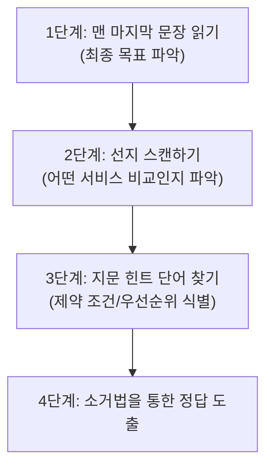

이 페이지는 **[실전 문제 풀이 기술](../real-exam-tactics/)**에서 다룬 '**긴 지문 대응을 위한 스키밍 기술**'(Skimming)을 10개의 샘플 문제에 직접 적용하여, 정답을 도출해내는 사고 과정(Thought Process)을 단계별로 추적합니다.

시험장에서 직면하는 시간 부족을 해결하기 위해 아래 3단계 공식에 맞춰 문제를 해독하는 연습을 해보세요.

---

### Q1. Cost Control and Autonomy in a Multi-Account Environment

#### 1단계: 맨 마지막 문장 (최종 목표)
> *"Which solution should the solutions architect recommend to meet these requirements?"*
* **의도:** 계정의 보안 침해로 인한 대량 인스턴스 기동 및 고액 청구 문제를 겪은 후, 전체 계정의 과도한 비용 지출을 예방하는 설계를 찾는 것이 목표입니다.

#### 2단계: 선지 스캔 (대상 서비스 비교)
* **A, B:** SCP(Service Control Policy) 및 IAM 정책을 활용하여 `ec2:instanceType` 조건으로 차단.
* **C:** Billing Alerts (결제 알람) + CloudWatch + SNS 경보 발송.
* **D:** Cost Explorer 보고서의 주기적 수동 검토.

#### 3단계: 지문 힌트 단어 및 제약 조건
* "**Each business group wants to retain full control of its AWS account**" (핵심 제약 조건): 각 비즈니스 그룹은 자신의 계정에 대해 **완전한 통제권**(자율성)을 유지해야 합니다.
* "**prevent excessive spending**" (목표): 과도한 비용 지출 예방.

#### 4단계: 소거 및 도출
* **A, B 소거:** 특정 인스턴스 유형 사용을 차단하는 SCP(A)나 IAM 정책(B)은 비즈니스 그룹이 요구한 "완전한 계정 통제권 보유"에 위배됩니다. 특정 그룹이 연구/분석용 고스펙 인스턴스를 정상적으로 사용해야 할 권리까지 빼앗게 됩니다.
* **D 소거:** 주기적으로 보고서를 직접 확인하는 방식은 실시간으로 대량의 인스턴스가 생성되는 비정상 상황을 즉각 예방하거나 감지할 수 없습니다.
* **C 정답:** 결제 알람을 활성화하고 임계값 돌파 시 알림을 보내는 방식은 인스턴스 생성 권한을 물리적으로 차단(통제권 박탈)하지 않으면서도, 지출 급증 상황을 실시간으로 감지하고 즉시 대응할 수 있는 가장 최선의 타협안입니다.

---

### Q2. Integrating Third-Party Monitoring in a Multi-Account Environment

#### 1단계: 맨 마지막 문장 (최종 목표)
> *"What should the solutions architect do to provide the monitoring solution with the required permissions?"*
* **의도:** 별도 AWS 계정에서 작동하는 서드파티 모니터링 툴에 대해 멀티 계정 환경 전체를 모니터링할 수 있는 권한을 위임하는 아키텍처를 구성해야 합니다.

#### 2단계: 선지 스캔 (대상 서비스 비교)
* **A:** AWS SSO(Identity Center) 디렉터리에 계정 생성 및 자격 증명 공유.
* **B:** Organizations 관리(Management) 계정에 IAM 역할 생성 및 신뢰 관계 설정.
* **C:** 서드파티 계정을 조직(Organizations) 멤버로 초대.
* **D:** CloudFormation StackSets로 교차 계정 IAM 역할(Cross-Account Role) 배포.

#### 3단계: 지문 힌트 단어 및 제약 조건
* "**multiple AWS accounts in an organization**" (배경): 조직 내의 여러 연결된 계정들.
* "**read-only access across all AWS accounts**" (권한 범위): 모든 계정에 대한 읽기 전용 권한 필요.
* "**monitoring solution will run in its own AWS account**" (행동 주체): 서드파티 계정(외부 계정)에서 연동되어 들어옴.

#### 4단계: 소거 및 도출
* **A 소거:** AWS SSO(Identity Center) 자격 증명은 대화형 로그인(사람) 중심이며 일시적이라 세션이 만료되면 다시 로그인해야 하므로 자동화된 서드파티 툴 연동에 부적합합니다. 또한 보안 규정상 비밀번호를 넘겨주는 것은 금지됩니다.
* **B 소거:** 관리(Management) 계정에만 역할을 만들면 하위 멤버 계정의 리소스에 읽기 권한을 행사할 수 없습니다.
* **C 소거:** 단순히 조직에 계정을 가입시킨다고 해서 멤버 계정들로의 리소스 액세스 권한이 자동으로 생기지 않습니다.
* **D 정답:** 멀티 계정 환경에서 크로스 계정(Cross-Account) 접근을 안전하고 확장성 있게 구성하는 표준 기법은 신뢰 정책(Trust Policy)이 포함된 IAM 역할을 정의한 뒤, CloudFormation StackSets를 이용해 전체 linked 계정에 일괄 배포하는 것입니다.

---

### Q3. Prerequisites for Connecting Static Websites and API Gateway

#### 1단계: 맨 마지막 문장 (최종 목표)
> *"Which combination of steps must the team complete so that the form can successfully post to the API endpoint and receive a valid response? (Select TWO.)"*
* **의도:** S3에 올려진 HTML의 JS 폼에서 API Gateway로 POST를 보내 정상적인 응답을 받아내기 위한 인프라 설정을 2가지 골라야 합니다.

#### 2단계: 선지 스캔 (대상 서비스 비교)
* **A, D:** S3 버킷에 CORS 적용 vs API Gateway에 CORS 적용.
* **B:** EC2 호스팅으로 전환.
* **C:** API Gateway의 쿼터 상향 요청.
* **E:** S3 웹 사이트 호스팅 활성화.

#### 3단계: 지문 힌트 단어 및 제약 조건
* "**HTML form that is hosted in a public Amazon S3 bucket**" (상황 1): 사용자가 웹 폼을 여는 출처(Origin)는 S3.
* "**uses JavaScript to post data to an Amazon API Gateway API endpoint**" (상황 2): JS가 완전히 다른 도메인(API Gateway)으로 비동기 HTTP 요청을 보냄 (Cross-Origin 상황).

#### 4단계: 소거 및 도출
* **B, C 소거:** 서버리스 비용 이점과 요구사항(S3 호스팅)을 EC2로 변경(B)할 필요가 전혀 없으며, 쿼터 제한(C)은 단순 기능 작동 장애와 연관이 없습니다.
* **E 정답 (S3 측 설정):** S3의 HTML 파일을 외부에서 웹 브라우저 브라우징이 가능하도록 '웹 사이트 호스팅(Static Web Hosting)'으로 구성해야 폼이 서비스됩니다.
* **D 정답 (CORS 설정):** 브라우저 보안 기능인 CORS는 호출되는 대상(Target) 서버에서 설정해야 브라우저의 차단을 우회합니다. 호출 주체(Origin)가 S3이고 대상(Target)이 API Gateway이므로, **API Gateway에서 CORS를 활성화(D)**해야 정상 응답을 처리할 수 있습니다. (S3에 CORS를 설정(A)하는 것은 외부에서 S3 객체를 AJAX로 읽어갈 때 쓰는 오답 패턴입니다.)

---

### Q4. Resolving API Gateway 502 (Bad Gateway) Errors

#### 1단계: 맨 마지막 문장 (최종 목표)
> *"Which solution will resolve this issue?"*
* **의도:** 대용량 트래픽 급증 시 발생하는 API Gateway 502(Bad Gateway) 오류를 해결해야 합니다.

#### 2단계: 선지 스캔 (대상 서비스 비교)
* **A:** Lambda 동시성 할당량(Concurrency Quota) 증설 및 CloudWatch 알람.
* **B:** API Gateway TPS 쿼터 대응 Lambda 개발.
* **C:** Cognito 사용자 풀 리전 분할.
* **D:** DynamoDB Strongly Consistent Reads 적용.

#### 3단계: 지문 힌트 단어 및 제약 조건
* "**During large surges in traffic**" (유발 조건): 대규모 트래픽 폭증 시에만 현상 발생.
* "**API Gateway... returning HTTP status code 502 (Bad Gateway) errors**" (에러 유형): API Gateway 자체의 스로틀링(429)이나 시간 초과(504)가 아닌 백엔드(Lambda)의 응답 실패 상태.

#### 4단계: 소거 및 도출
* **B 소거:** API Gateway의 초당 트래픽 제한(TPS)을 초과한 경우는 API Gateway단에서 스로틀링(HTTP 429)을 던집니다. 또한 쿼터 한도는 실시간으로 Lambda에 의해 동적으로 상향 조절되지 않습니다.
* **C, D 소거:** 로그인 처리 지연(C)이나 DynamoDB의 일관된 읽기(D) 옵션은 API Gateway와 Lambda 간의 통신에서 발생하는 502 오류의 원인이 아닙니다.
* **A 정답:** Lambda 함수가 **동시성 할당량**(Concurrency Quota)을 초과해 기동되지 못하면, API Gateway는 백엔드 호출 실패로 간주해 HTTP 502(Bad Gateway) 오류를 사용자에게 전달합니다. 따라서 동시성 쿼터를 상향 조정하는 것이 정답입니다.

---

### Q5. Remote Instance Management under Strict Inbound Security Group Rules

#### 1단계: 맨 마지막 문장 (최종 목표)
> *"Which solution will meet these requirements?"*
* **의도:** 인바운드 보안 그룹이 강력히 제약된 조건에서 100대의 컨테이너 클러스터 인스턴스들을 안전하게 원격 제어하는 기법을 찾아야 합니다.

#### 2단계: 선지 스캔 (대상 서비스 비교)
* **A, B:** SSH 포트를 2222로 수정 후 사용자 데이터 또는 Trusted Advisor로 원격 접속.
* **C, D:** SSH 키페어 없이 시작 후 Systems Manager Run Command vs Trusted Advisor로 접속.

#### 3단계: 지문 힌트 단어 및 제약 조건
* "**block all inbound traffic except HTTPS (port 443)**" (보안 제약 조건): 보안 그룹 인바운드는 오직 HTTPS(443) 포트만 외부에서 접근 허용됨. 22번이나 2222번 포트 등은 인바운드가 모두 차단되어 통과할 수 없음.
* "**remotely manage**" (목표): 원격 명령 실행 가능해야 함.

#### 4단계: 소거 및 도출
* **A, B 소거:** SSH 포트를 2222로 변경하더라도 인바운드 2222 포트를 보안 그룹에서 차단하고 있으므로 접속할 수 없습니다.
* **B, D 소거:** Trusted Advisor는 분석 도구이지 인스턴스에 명령을 전송하고 관리하는 기능을 제공하지 않습니다.
* **C 정답:** **AWS Systems Manager Run Command**는 인바운드 포트를 단 하나도 열지 않아도(0.0.0.0/0 -> 22/2222 인바운드 차단), 인스턴스 내부의 SSM 에이전트가 AWS 엔드포인트를 향해 **아웃바운드 HTTPS**(443) 채널을 맺어 폴링하는 형태로 작동합니다. 따라서 보안 정책을 완벽하게 준수하는 최적의 솔루션입니다.

---

### Q6. Least-Privilege Cross-Account Access and Single Credentials Design

#### 1단계: 맨 마지막 문장 (최종 목표)
> *"Which strategy will meet these requirements?"*
* **의도:** 개발계정/운영계정 분리 상황에서 권한 제한과 로그인 효율을 극대화하는 멀티 계정 설계입니다.

#### 2단계: 선지 스캔 (대상 서비스 비교)
* **A, B:** 각 계정에 사용자를 물리적으로 생성하는 다중 자격 증명 모델.
* **C, D:** 단일 계정에 IAM 사용자를 집약시키고 타 계정에 임시 권한(AssumeRole)을 행사하는 크로스 계정 모델.

#### 3단계: 지문 힌트 단어 및 제약 조건
* "**Developers must have no access to production infrastructure**" (권한 제약): 개발자는 운영에 접근 금지.
* "**All users must have a single set of AWS credentials**" (사용자 제약): 모든 사용자는 자격 증명 세트를 단 **1개**만 소유해야 함.

#### 4단계: 소거 및 도출
* **A, B 소거:** 사용자가 개발 계정과 운영 계정 양쪽에 IAM 유저(Credentials)를 각자 가지고 로그인하게 유도하므로 "단일 자격 증명 세트(single set)" 요구사항에 어긋납니다.
* **C 소거:** 공유 IAM 역할을 개발 계정(Development Account)에 만드는 것은 운영 계정(Production Account)의 리소스를 안전하게 통제 및 마이그레이션하는 표준 크로스 계정 아키텍처에 해당되지 않습니다.
* **D 정답:** 사용자는 오직 개발 계정(Development Account)에만 존재하여 자격 증명을 일원화합니다. 운영 계정에는 개발 계정을 신뢰하는 크로스 계정 IAM 역할을 생성하고 개발 계정의 운영 그룹(Operations Group) 사용자들에게만 이 역할을 AssumeRole 할 수 있는 권한을 주어 개발자의 침입을 완벽히 격리합니다.

---

### Q7. Reducing Costs in Big Data Pipelines and Exception Processing

#### 1단계: 맨 마지막 문장 (최종 목표)
> *"Which combination of changes to the application will MOST reduce costs? (Select TWO.)"*
* **의도:** 빅데이터 파이프라인의 입출력 과정 및 예외 처리 아키텍처의 비용을 가장 크게 줄이는 2가지 조합을 선택해야 합니다.

#### 2단계: 선지 스캔 (대상 서비스 비교)
* **A, E:** EC2 인스턴스 사양 줄이기 또는 최소 수량 축소.
* **B:** EC2 Auto Scaling을 제거하고 SQS 연동 Lambda로 교체.
* **C, D:** Kinesis Shard 비율을 10:1 vs 2:1로 다르게 지정.

#### 3단계: 지문 힌트 단어 및 제약 조건
* "**each device sends between 50 KB and 450 KB of data each second**" (샤드 용량 한계): 디바이스당 최대 초당 450KB 전송. Kinesis 단일 샤드는 최대 1MB/s(1,000KB/s) 인입 한계를 지님.
* "**average of 10 outlying values every hour**", "**runs a 30-second process**" (컴퓨팅 빈도): 예외 데이터는 시간당 10개만 들어오고, 처리 시간은 각 30초에 불과함.

#### 4단계: 소거 및 도출
* **B 정답 (컴퓨팅 비용):** 1시간당 처리해야 할 총연산 시간은 `10개 * 30초 = 300초(5분)`에 불과합니다. 이를 처리하기 위해 EC2 인스턴스 2대를 24시간 내내 대기시키는 것은 매우 낭비입니다. SQS 메시지가 올 때만 켜져서 연산하는 Lambda(B)를 적용하면 사실상 대기 컴퓨팅 비용을 0으로 만들어 비용을 극적으로 낮춥니다. (A, E 소거)
* **D 정답 (샤드 비용):** Kinesis Data Stream은 활성화된 샤드 개수 단위로 과금됩니다. 10개 장치를 1개 샤드로 결합하면(C) 최대 `450KB * 10 = 4.5MB/s`가 되어 샤드 허용 한도인 1MB/s를 초과해 데이터 유실이 발생하므로 불가합니다. 따라서 최대 `450KB * 2 = 900KB/s`로 1MB/s 한계 이내에 정확히 맞아떨어지게 세팅하는 **2:1 비율(D)**이 샤드 비용을 안전하게 절반으로 감소시키는 유일한 솔루션입니다.

---

### Q8. Asynchronous Decoupling and Rate Limiting for Third-Party APIs

#### 1단계: 맨 마지막 문장 (최종 목표)
> *"Which combination of architectural changes... to ensure that the entire process functions correctly under load? (Select TWO.)"*
* **의도:** 급증하는 마케팅 주문 부하 상황에서 서드파티 제휴사 API가 오작동하지 않게 보호하면서 전체 주문 전송 프로세스를 유실 없이 완결시켜야 합니다.

#### 2단계: 선지 스캔 (대상 서비스 비교)
* **A, B:** 비동기 Lambda 호출 vs SQS 대기열 도입 + Lambda 트리거.
* **C, E:** Lambda의 타임아웃/메모리 상향.
* **D:** Lambda의 예약된 동시성(Reserved Concurrency) 하향.

#### 3단계: 지문 힌트 단어 및 제약 조건
* "**increased request rate overwhelmed the third-party affiliate**" (핵심 문제): 동시 요청량의 폭증으로 상대 측(Affiliate API)이 병목을 겪어 요청을 거부/실패함. 즉, 클라이언트단에서 나가는 요청 속도를 안전하게 조율(Rate Limiting)해야 함.

#### 4단계: 소거 및 도출
* **A 소거:** 단순히 Lambda를 비동기 호출만 하면 EC2 인스턴스 20개에서 들어오는 모든 호출 수만큼 Lambda가 동시 병렬 실행되어 결국 제휴사 서버로 전달되는 동시 요청 수는 그대로 유지되므로 해결이 불가능합니다.
* **C, E 소거:** 지연시간 연장이나 램 용량 추가는 외부 서버의 한계 도달 문제를 해결해 주지 못합니다.
* **B 정답 (버퍼링):** SQS 큐를 도입하여 즉시 전송해야 하는 주문 데이터를 대기열에 임시 보관해두는 버퍼를 형성합니다.
* **D 정답 (트래픽 스로틀링):** SQS에서 메시지를 읽어 전송하는 Lambda의 **예약된 동시성**(Reserved Concurrency)을 매우 낮게 고정하면, 한 번에 상대 측으로 향하는 동시 API 호출 숫자가 물리적으로 제한되어 상대 서버를 보호합니다. 제한을 넘어서 처리되지 못한 메시지는 SQS에 그대로 남았다가 순차적으로 처리되므로 유실이 전혀 발생하지 않습니다.

---

### Q9. Active-Active Multi-Region Deployment with Minimal Changes

#### 1단계: 맨 마지막 문장 (최종 목표)
> *"Which combination of steps will meet these requirements with the LEAST change to the architecture? (Select THREE.)"*
* **의도:** 아키텍처 개편 및 코드 수정 최소화 조건 아래, 2개 리전 전체에서 트래픽을 처리하는 Active-Active 아키텍처를 구축하는 3단계를 찾아야 합니다.

#### 2단계: 선지 스캔 (대상 서비스 비교)
* **A, B:** ECR 리전 복제 vs VPC Endpoint 구축.
* **C, D:** App Runner 배포 대상 설정 변경 vs 다른 리전에 신규 배포 + Route 53 지연 시간 라우팅.
* **E, F:** 관계형 DB를 DynamoDB 글로벌 테이블로 완전 전환 vs Aurora Global DB + 쓰기 전달(Write Forwarding) 사용.

#### 3단계: 지문 힌트 단어 및 제약 조건
* "**LEAST change to the architecture**" (제약 사항): 구조적 개편 최소화.
* "**active-active configuration**" (목표): 양방향 리전 서비스.

#### 4단계: 소거 및 도출
* **E 소거:** 현재 사용 중인 관계형 데이터베이스(Aurora MySQL)를 완전히 아키텍처가 다른 NoSQL인 DynamoDB 글로벌 테이블(E)로 변경하려면 애플리케이션의 전체 데이터 모델과 쿼리 로직을 새로 작성해야 하므로 최소 변경 원칙에 정면 위배됩니다.
* **C 소거:** App Runner는 단일 배포 정의로 여러 리전에 자동 프로비저닝하는 기능이 없으므로 옵션 구조가 불가합니다.
* **A, D, F 정답:**
  - 서브 리전의 App Runner가 신속하게 컨테이너 이미지를 받아올 수 있도록 ECR 교차 리전 복제(A)를 세팅합니다.
  - 서브 리전에 App Runner 서비스를 추가 기동하고 Route 53의 지연 시간 라우팅(D)을 적용하여 분산 처리합니다.
  - 기존 Aurora RDBMS 호환성을 지키면서 서브 리전의 쓰기 요청을 메인 리전으로 자동 중계하는 **Aurora Global DB + Write Forwarding**(F) 기능을 조합하여 최소 변경 멀티 리전 마이그레이션을 완결합니다.

---

### Q10. Modernizing Legacy Stacks and Minimizing Operational Overhead

#### 1단계: 맨 마지막 문장 (최종 목표)
> *"Which combination of actions should the solutions architect take to meet these requirements?"*
* **의도:** 성능을 올리며 운영 오버헤드(관리 공수)를 최소화할 수 있는 인프라 현대화 조합 2가지를 선별합니다.

#### 2단계: 선지 스캔 (대상 서비스 비교)
* **A, C:** 수동 다중 EC2 MySQL vs Aurora Serverless 마이그레이션.
* **B, E:** Windows 웹 인스턴스를 ALB 배후로 이동 vs ALB를 자체 구축 로드밸런서로 교체.
* **D:** 전체 스택을 ARM 기반 Graviton2 인스턴스로 전환.

#### 3단계: 지문 힌트 단어 및 제약 조건
* "**Windows-based web tier**" (제약 조건): 웹 서버가 윈도우(Windows) 기반으로 가동 중임.
* "**minimize the operational overhead**" (핵심 지표): 인프라 관리 부담 최소화.

#### 4단계: 소거 및 도출
* **A, E 소거:** 수동 다중 EC2 DB 구성(A)이나 자체 관리형 로드밸런서 개발(E)은 인프라 관리 포인트를 엄청나게 확장시켜 오버헤드를 높이므로 소거합니다.
* **D 소거:** AWS Graviton 칩셋은 ARM 아키텍처이므로 Linux 계열에는 훌륭하나 Windows의 경우 지원하지 않거나 대대적인 앱 리팩토링이 불가피합니다. 따라서 모든 인스턴스를 Graviton2(D)로 일괄 마이그레이션하는 방안은 높은 운영 공수가 발생하므로 오답입니다.
* **B 정답:** Elastic IP를 수동 매핑하여 단일 가동되던 독립형 Windows 웹 EC2들을 로드밸런서(ALB) 배후로 정렬하여 부하를 다중 분산하는 기초 현대화를 이룹니다.
* **C 정답:** EC2 위에서 직접 백업과 패치, 스케일링을 관리하던 자가 설치형 MySQL을 완전관리형 오토 스케일링 DB 제품인 **Aurora Serverless**(C)로 이전하여 운영 관리 공수를 원천 제거합니다.
