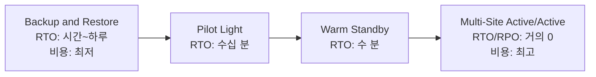
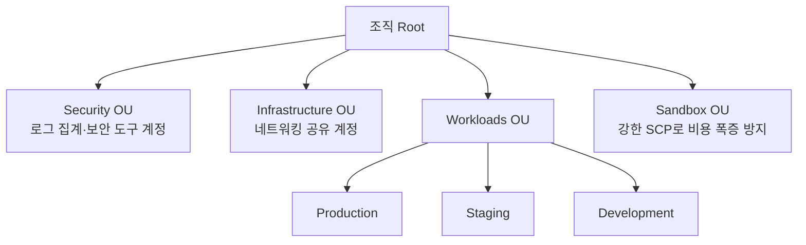

스타트업 시절에는 AWS 계정 하나, VPC 하나로 충분합니다. 하지만 조직이 커지면 "개발팀과 운영팀이 같은 계정을 쓰다가 사고를 낸다", "리전 전체 장애가 나면 얼마나 빨리 복구되는가", "보안팀이 모든 계정의 규정 준수를 일일이 확인할 수 없다" 같은 문제가 반드시 생깁니다. 이 도메인은 네트워크·보안·복원력·계정 구조·비용을 **조직 전체 단위**로 설계하는 방법을 다룹니다.


공식 SAP-C02 Exam Guide 기준 **Domain 1(가중치 26%)** 에 해당하며, Task 1.1~1.5로 구성됩니다. 전체 도메인 가중치와 다른 도메인과의 관계는 **[SAP-C02 시험 청사진](../../exam-prep/sap-exam-domains/)** 에서 확인하세요.


## Task 1.1: 네트워크 연결 전략 설계

계정과 VPC가 늘어나면 VPC Peering만으로는 N개 VPC 사이에 N(N-1)/2개의 연결을 일일이 관리해야 하는 문제가 생깁니다. **Transit Gateway**는 모든 VPC와 온프레미스 연결이 하나의 중앙 허브를 거치도록 만들어 연결 관리를 단순화합니다.

- 여러 리전의 Transit Gateway를 피어링하여 글로벌 네트워크 구성 가능
- Route Table을 통해 VPC 간 통신을 세밀하게 제어 (예: Production VPC는 Security VPC만 경유 가능)
- Direct Connect Gateway, VPN 연결과도 통합되어 온프레미스-클라우드 하이브리드 구조의 중심이 됨

온프레미스 데이터센터를 AWS와 연결하는 두 가지 주요 방법은 다음과 같습니다.

- **Direct Connect**: 전용 회선으로 AWS와 물리적으로 직접 연결. 안정적인 대역폭과 낮은 지연시간을 제공하지만 구축에 몇 주가 소요됨. 이중화를 위해 두 개의 다른 위치에서 두 회선을 구성하는 것이 권장 패턴
- **Site-to-Site VPN**: 인터넷 위에 IPsec 터널을 구성. 구축이 빠르고(분 단위) 비용도 낮지만 인터넷 대역폭에 의존하므로 성능이 가변적

실무에서는 Direct Connect를 주 연결로, Site-to-Site VPN을 페일오버 백업 경로로 함께 구성하는 것이 일반적입니다. 하이브리드 DNS(Route 53 Resolver로 온프레미스 DNS와 통합)까지 포함해야 온전한 연결 전략이 완성됩니다.

## Task 1.2: 보안 제어 규정

SAA 수준에서는 "IAM으로 최소 권한을 부여한다", "KMS로 데이터를 암호화한다" 정도를 알면 충분했습니다. 이 작업에서는 그 위에 "수백 개 계정의 보안 상태를 한눈에 파악하고, cross-account 키 사용까지 통제하는" 설계가 추가됩니다.

**KMS 키 정책과 멀티 리전 키**: 모든 KMS 키는 반드시 키 정책을 가지며, 이 정책이 "누가 이 키를 사용할 수 있는가"의 1차 관문입니다. IAM 정책으로 권한을 부여했더라도 키 정책이 허용하지 않으면 접근이 거부됩니다. 다른 계정의 사용자가 키를 쓰게 하려면(Cross-account) 키 정책에서 명시적으로 허용해야 합니다. **멀티 리전 키**는 같은 키 ID를 여러 리전에서 공유해, 한 리전에서 암호화한 데이터를 다른 리전에서 복호화할 수 있게 해줍니다 — Multi-Region DR 구조에서 KMS로 암호화된 RDS 스냅샷이나 EBS 볼륨을 리전 간 복제할 때 필수적입니다.

**GuardDuty**는 VPC Flow Logs, CloudTrail, DNS 로그를 머신러닝으로 분석해 비정상 행위(악성 IP 통신, 비정상 API 호출, 암호화폐 마이닝 흔적)를 탐지합니다. Organizations와 연동하면 모든 멤버 계정의 탐지 결과를 보안 계정(Delegated Administrator)에서 한 번에 모아볼 수 있습니다.

**Security Hub**는 GuardDuty, Inspector, Macie, Config 등 여러 보안 서비스의 탐지 결과를 표준화된 형식(AWS Security Finding Format)으로 모아 보여주는 대시보드이며, CIS AWS Foundations Benchmark·PCI DSS 같은 표준 준수 점수도 자동 계산합니다.


GuardDuty, Security Hub, Config는 각각 "탐지", "통합 표시", "구성 준수 검증"이라는 다른 역할을 합니다. "어떤 행위가 의심스러운가"는 GuardDuty, "전체 보안 점수와 표준 준수는 어떤가"는 Security Hub로 구분하세요. Config를 활용한 **자동 교정(Auto-Remediation)** 워크플로는 운영 중인 솔루션을 개선하는 작업이라 **[도메인 3: 보안 개선](../domain3-continuous-improvement/)** 에서 다룹니다.


## Task 1.3: 신뢰할 수 있고 복원력을 갖춘 아키텍처 설계

"리전 전체가 장애를 일으키면 우리 서비스는 얼마나 빨리 복구되는가?"에 답하려면 먼저 두 지표를 정의해야 합니다.

- **RTO (Recovery Time Objective)**: 장애 발생 후 서비스가 복구되기까지 허용 가능한 최대 시간
- **RPO (Recovery Point Objective)**: 장애 발생 시 허용 가능한 최대 데이터 손실 범위(시간 기준)

AWS는 비용과 복구 속도의 trade-off에 따라 4가지 DR 전략을 제시합니다.

| 전략 | 핵심 동작 | 적합한 신호 키워드 |
|---|---|---|
| Backup and Restore | 백업(S3/AWS Backup)에서 장애 시 인프라 재구성 | "최소 비용" |
| Pilot Light | 핵심 데이터만 보조 리전에 최신 유지, 나머지는 장애 시 기동 | "예산은 제한적이나 어느 정도 신속한 복구" |
| Warm Standby | 보조 리전에 축소 규모로 항시 가동, 장애 시 확장 | "수 분 내 복구" |
| Multi-Site Active/Active | 두 리전 모두 운영 트래픽 처리, Route 53로 분산 | "다운타임 거의 0", "RPO 거의 0" |


시험에서는 예산 제약과 RTO/RPO 요구사항을 먼저 읽고 위 4단계 중 어디에 해당하는지 매칭하는 패턴이 반복됩니다. Multi-Region DR은 네트워킹 설계 없이는 완성되지 않으므로, 보조 리전 페일오버 시 온프레미스·다른 VPC와의 연결까지 함께 전환되도록 **Task 1.1의 Transit Gateway·Direct Connect Gateway 구성**과 반드시 같이 설계해야 합니다. 신뢰성(Reliability) 원칙 자체는 **[Well-Architected: 신뢰성 기둥](../../well-architected/reliability-pillar/)** 에서 더 다룹니다.


## Task 1.4: 다중 계정 AWS 환경 설계

**AWS Organizations**는 여러 AWS 계정을 하나의 조직 구조로 묶어 관리하는 서비스입니다. 계정들을 OU(Organizational Unit) 트리로 그룹화하고, 결제를 통합(Consolidated Billing)하며, 정책을 OU 단위로 일괄 적용합니다. 일반적인 OU 구조는 다음과 같습니다.

**Control Tower**는 Organizations, IAM Identity Center, Config, CloudTrail을 조합해 멀티 계정 환경의 모범 사례를 자동으로 구성해주는 관리형 서비스입니다. Control Tower가 만들어내는 표준화된 멀티 계정 구조를 **Landing Zone**이라 부르며, 새 계정 생성 시 표준 OU 배치·필수 가드레일 적용·중앙 로깅 연결·SSO 권한 부여를 자동으로 처리합니다.

**SCP**(Service Control Policy)는 OU나 계정 단위로 적용되며, IAM 정책과 달리 권한을 "부여"하지 않고 권한의 **상한선**을 정의합니다. SCP가 허용하지 않은 API 호출은 루트 사용자를 포함해 누구도 실행할 수 없습니다. 대표 패턴: 특정 리전 외 리소스 생성 차단, 루트 사용자 액세스 키 생성 차단, Sandbox OU에서 GPU 인스턴스 생성 차단.


**핵심 구분**: Organizations는 "계정을 묶는 뼈대"이고 Control Tower는 "그 뼈대 위에 모범 사례를 자동으로 얹어주는 도구"입니다. "수동으로 멀티 계정 거버넌스를 구축하는 작업을 줄이려면?"이라는 문제가 나오면 Control Tower가 정답일 확률이 높습니다.



SCP는 마스터(관리) 계정에는 적용되지 않습니다. 마스터 계정은 워크로드를 직접 운영하지 않고 결제·거버넌스 관리 전용으로 쓰는 것이 권장 패턴입니다.


## Task 1.5: 비용 최적화 및 가시성 전략 결정

온디맨드보다 저렴하게 컴퓨팅을 약정하는 두 가지 방법이 있습니다.

- **Savings Plans**: 시간당 사용 금액을 1~3년 약정. EC2·Fargate·Lambda에 걸쳐 유연하게 적용되며 인스턴스 패밀리·리전이 바뀌어도 할인 유지(Compute Savings Plans 기준)
- **Reserved Instances (RI)**: 특정 인스턴스 유형·리전을 1~3년 약정. Standard RI는 할인율이 가장 높지만 유연성이 낮고, Convertible RI는 다른 유형으로 교환 가능

**Cost Explorer**는 계정/서비스/태그별 비용 추이를 시각화하고 RI/Savings Plans 구매를 추천합니다. Organizations와 연동하면 모든 멤버 계정의 비용을 통합 계정에서 조회할 수 있습니다. **Compute Optimizer**는 CloudWatch 사용률 데이터를 ML로 분석해 EC2·EBS·Lambda·ASG의 적정 크기를 추천하며, **S3 Storage Lens**는 조직 전체의 스토리지 사용 패턴과 비용 절감 기회를 시각화합니다.

조직 전체에 비용 통제 문화를 정착시키려면 다음 구조가 필요합니다.

1. **태깅 전략**: `Project`, `Environment`, `Owner` 같은 필수 태그를 SCP나 Tag Policy로 강제
2. **예산 알림(AWS Budgets)**: 계정·태그·서비스별 예산을 설정하고 임계값 도달 시 SNS로 알림
3. **Service Catalog**: 개발팀이 비용 최적화된 사전 승인 템플릿만 배포하도록 제한


태깅 전략은 "나중에 추가"하면 늦습니다. 계정·리소스를 처음 만들 때부터 태그를 강제하지 않으면, 비용이 커진 후에는 어떤 리소스가 어떤 프로젝트 소속인지 역추적하는 데 막대한 시간이 듭니다. **Task 1.4의 조직 구조 설계** 단계에서부터 태깅 정책을 함께 설계하세요. Right-sizing을 지속적인 프로세스로 운영하는 방법은 **[도메인 3: 비용 최적화 기회 파악](../domain3-continuous-improvement/)** 에서 다룹니다.


## 다음 단계

조직의 뼈대(네트워크·보안·복원력·계정·비용 가시성)를 세웠다면, 이제 그 위에 **새로운 워크로드를 설계하는 기준**이 필요합니다. **[도메인 2: 새로운 솔루션을 위한 설계](../domain2-new-solution-design/)** 로 이어가세요.
