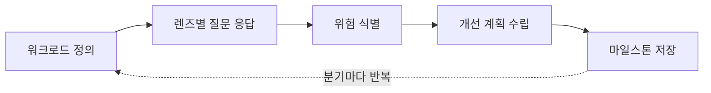
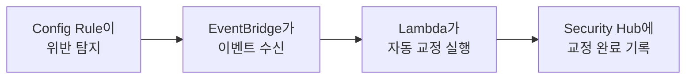

아키텍처는 한 번 잘 설계했다고 끝나는 것이 아닙니다. 트래픽 패턴이 바뀌고, 새로운 AWS 서비스가 출시되고, 팀 규모가 변하면서 어제의 좋은 설계가 오늘의 비효율이 될 수 있습니다. 이 도메인은 "이미 운영 중인 워크로드를 어떻게 정기적으로 점검하고 개선하는가"를 다루며, **[④ Well-Architected Framework](../../well-architected/)** 의 6 Pillars가 가장 직접적으로 적용되는 영역입니다.


공식 SAP-C02 Exam Guide 기준 **Domain 3(가중치 25%)** 에 해당하며, Task 3.1~3.5로 구성됩니다.


## Task 3.1: 전반적인 운영 우수성을 개선하기 위한 전략 결정

**AWS Well-Architected Tool**은 Management Console에서 무료로 쓸 수 있는 자가 진단 도구입니다. 운영 중인 워크로드를 등록하고 6 Pillars에 걸친 질문에 답하면, 현재 설계의 위험 요소(High/Medium Risk Issue)를 자동으로 식별해줍니다.

1. **워크로드 정의**: 검토 대상의 환경(Production/Pre-production), 관련 계정, 적용할 **Lens**(서버리스·SaaS·머신러닝 등 도메인 특화 추가 질문 세트)를 지정
2. **렌즈별 질문 응답**: 각 Pillar의 질문(예: "장애 발생 시 자동으로 복구되는가?")에 현재 상태를 체크
3. **위험 식별**: 답변 기반으로 위험 항목을 자동 분류하고 관련 문서·권장 사항 연결
4. **개선 계획 수립**: 우선순위 높은 위험부터 백로그에 등록
5. **마일스톤 저장**: 개선 후 재검토해 위험이 줄었는지 시점별로 비교

배포 프로세스 개선도 이 작업의 범위입니다 — 블루/그린·롤링 배포 같은 전략이 이미 적용되어 있는지, CloudWatch 기반 모니터링·로깅이 충분한지, Systems Manager로 구성 관리 자동화가 가능한 영역은 없는지 평가합니다.


**실무 팁**: Well-Architected Tool 리뷰는 분기 단위로 정례화하는 것이 효과적입니다. 마일스톤 기능으로 "지난 리뷰 대비 위험이 몇 개 줄었는가"를 추적하면 개선 활동을 정량적으로 보여줄 수 있습니다.


## Task 3.2: 보안을 개선하기 위한 전략 결정

**AWS Config**는 리소스 구성 상태를 지속적으로 기록하고, 정해진 Config Rule을 위반하는 리소스를 자동 탐지합니다. **Config Conformance Pack**으로 여러 규칙을 묶어 조직 전체에 일괄 배포할 수 있습니다. 여기에 **자동 교정(Auto-Remediation)** 까지 구성하면 컴플라이언스 위반을 사람이 수동으로 고치지 않고 시스템이 자동 복구하게 만들 수 있습니다.

이 외에도 다음과 같은 개선 작업이 이 Task의 범위입니다.

- **보안 정보·인증 정보 관리**: Secrets Manager로 비밀값의 자동 순환(rotation) 적용 여부 점검
- **최소 권한 액세스 감사**: IAM Access Analyzer로 과도한 권한이 부여된 역할·정책 탐지
- **추적 가능성 검토**: CloudTrail 로그가 모든 계정·리전에서 누락 없이 수집되고 있는지 확인
- **패치·백업 프로세스**: Systems Manager Patch Manager로 패치 적용을 자동화하고, AWS Backup으로 백업 정책을 중앙에서 일괄 관리

## Task 3.3: 성과 개선을 위한 전략 결정

비즈니스 요구 사항을 **측정 가능한 지표(SLA, KPI)** 로 변환하는 것이 출발점입니다. CloudWatch 지표를 기반으로 성능 병목 현상을 파악하고, 다음과 같은 고성능 아키텍처 기법으로 개선합니다.

- **오토 스케일링·인스턴스 플릿·배치 그룹**: 워크로드 특성에 맞는 확장 전략과 네트워크 지연을 최소화하는 인스턴스 배치
- **AWS Global Accelerator**: 사용자를 가장 가까운 AWS 엣지로 라우팅해 TCP/UDP 트래픽의 지연 시간을 줄임 (CloudFront는 HTTP(S) 콘텐츠 캐싱에 특화, Global Accelerator는 비-HTTP 트래픽이나 정적 IP가 필요한 경우에 적합)
- **새로운 관리형 서비스 채택**: 기존에 직접 운영하던 컴포넌트를 관리형 서비스로 교체할 기회를 지속적으로 탐색

## Task 3.4: 신뢰성을 개선하기 위한 전략 결정

애플리케이션의 성장·사용 추세를 이해하고, 기존 아키텍처를 평가해 신뢰성이 충분하지 않은 영역을 판별하는 작업입니다. 핵심은 **단일 장애 지점(SPOF, Single Point of Failure) 해결**입니다 — 다중 AZ로 분산되지 않은 컴포넌트, Auto Scaling이 구성되지 않은 인스턴스, 복제본이 없는 데이터베이스가 대표적인 SPOF 후보입니다. 데이터 복제, 자가 복구(Auto Recovery), 탄력적인 서비스로의 전환을 통해 이런 약점을 제거합니다. 서비스 할당량·한도가 성장한 트래픽 규모에 비해 충분한지도 정기적으로 재확인해야 합니다.

## Task 3.5: 비용 최적화를 위한 기회를 파악합니다

비용 최적화는 한 번 점검하고 끝내는 작업이 아니라 지속적인 프로세스입니다.

1. **사용 보고서 분석**: AWS Cost and Usage Report를 세분화된 수준에서 조사해 활용도가 낮거나 과도하게 활용되는 리소스를 파악
2. **미사용 리소스 탐지**: Trusted Advisor, Compute Optimizer의 추천을 정기적으로 리뷰
3. **과금 경보 설계**: 예상 사용 패턴을 기반으로 Budgets 알림 임계값을 재산정
4. **Cost Anomaly Detection**: 머신러닝 기반으로 평소와 다른 비용 패턴을 자동 감지
5. **비용 할당 점검**: 태깅 정책(**[도메인 1: Task 1.5](../domain1-organizational-complexity/)** 에서 설계)이 실제로 잘 지켜지고 있는지 주기적으로 감사

트래픽 패턴이 바뀌면 Savings Plans·RI 약정 규모도 함께 재검토해야 합니다. 약정 시점의 워크로드 규모와 현재 규모가 다르면 오히려 손해가 될 수 있습니다.

## 다음 단계

기존 솔루션 개선까지 다뤘다면 SAP-C02의 설계 범위는 거의 끝났습니다. 마지막으로 **[도메인 4: 워크로드 마이그레이션 및 현대화 가속화](../domain4-migration-modernization/)** 에서 온프레미스·레거시 워크로드를 클라우드로 옮기고 현대화하는 전략을 다룹니다.
