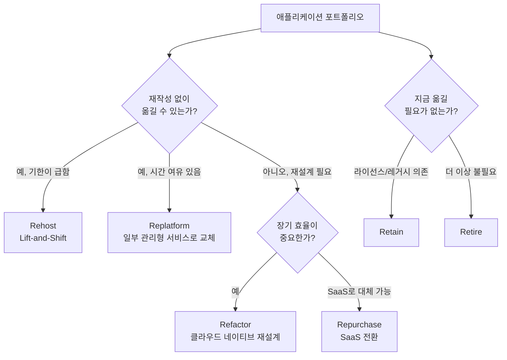

온프레미스 데이터센터를 AWS로 옮기는 작업은 "그대로 복사"부터 "완전히 재설계"까지 스펙트럼이 넓습니다. 이 도메인은 그 스펙트럼 안에서 비즈니스 제약(예산, 기한, 팀 역량)에 맞는 전략을 고르는 판단력을 평가합니다.


공식 SAP-C02 Exam Guide 기준 **Domain 4(가중치 20%)** 로 4개 도메인 중 비중은 가장 낮지만, 실무에서 마이그레이션 프로젝트를 맡게 될 확률은 결코 낮지 않은 영역입니다. Task 4.1~4.4로 구성됩니다.


## Task 4.1: 마이그레이션할 수 있는 기존 워크로드 및 프로세스를 선택합니다

대규모 마이그레이션은 보통 **포트폴리오 평가 → 자산 계획 → 우선순위 지정(웨이브 계획)** 순서로 진행됩니다. **AWS Application Discovery Service**로 온프레미스 서버의 사용률과 의존성을 먼저 수집하고, 이 데이터를 기반으로 각 애플리케이션을 분류합니다.

AWS가 정의하는 6가지 마이그레이션 전략(6R)은 "얼마나 많이 바꿀 것인가"를 기준으로 나뉩니다.

1. **Rehost (Lift-and-Shift)**: 코드를 거의 바꾸지 않고 EC2로 그대로 이전. 가장 빠르지만 클라우드 네이티브 이점을 충분히 활용 못함
2. **Replatform (Lift-Tinker-and-Shift)**: 코드는 유지하되 일부 컴포넌트를 관리형 서비스로 교체 (예: 자체 운영 MySQL → RDS)
3. **Refactor/Re-architect**: 클라우드 네이티브 아키텍처로 재설계. 가장 많은 시간이 들지만 장기적으로 가장 큰 효율
4. **Repurchase**: 기존 솔루션을 SaaS로 교체 (예: 자체 CRM → Salesforce)
5. **Retain**: 당장 이전하지 않고 유지 (라이선스 제약, 레거시 의존성)
6. **Retire**: 더 이상 필요 없는 애플리케이션 폐기

실무에서는 Relocate를 추가한 7R까지 확장해서 쓰기도 하지만, 시험에서는 6R 분류를 기준으로 출제됩니다. 분류 후에는 마이그레이션의 **총 소유 비용(TCO)** 을 평가해 실제로 클라우드 이전이 경제적으로 타당한지 검증합니다.


**판단 기준**: "빨리 옮겨야 하는가, 잘 옮겨야 하는가"가 핵심 trade-off입니다. 데이터센터 계약 종료가 임박했다면 Rehost, 장기적으로 운영 비용을 줄이고 싶다면 Replatform이나 Refactor를 우선 검토하세요.


## Task 4.2: 기존 워크로드를 마이그레이션하기 위한 최적의 접근 방식을 결정합니다

**AWS Migration Hub**는 여러 마이그레이션 도구(Application Migration Service, DMS, Migration Evaluator 등)의 진행 상황을 한 곳에서 모아 보여주는 대시보드로, 수백 대 서버를 이전하는 프로젝트에서 "지금 몇 대가 끝났는지"를 추적하는 용도로 씁니다.

| 마이그레이션 대상 | 주요 도구 |
|---|---|
| 대용량 파일/오브젝트 데이터 | AWS DataSync, AWS Transfer Family, Amazon S3 Transfer Acceleration |
| 오프라인/초대용량 데이터(페타바이트급) | AWS Snow Family |
| 애플리케이션 서버 | AWS Application Discovery Service(평가) → AWS Application Migration Service(이전) |
| 데이터베이스 | AWS DMS(데이터 이전) + AWS SCT(스키마 변환) |
| 네트워크 연결 | AWS Direct Connect, AWS Site-to-Site VPN, Amazon Route 53 |
| ID 통합 | AWS IAM Identity Center, AWS Directory Service |

**DMS**는 데이터베이스를 최소 다운타임으로 이전하는 서비스입니다. **동종 마이그레이션**(Oracle → Oracle처럼 같은 엔진)은 스키마 변환이 거의 필요 없지만, **이종 마이그레이션**(Oracle → Aurora PostgreSQL처럼 다른 엔진)은 **Schema Conversion Tool**(SCT)로 스키마와 저장 프로시저를 먼저 변환해야 합니다. DMS는 지속적 복제(CDC)를 지원해 초기 풀 로드 이후에도 원본 DB의 변경 사항을 실시간 반영하므로, 컷오버 시점의 다운타임을 수 분 이내로 줄일 수 있습니다.

마이그레이션 도구에는 적절한 보안 방법(전송 중 암호화, 최소 권한 IAM 역할)을 적용하고, 거버넌스 모델은 **[도메인 1: 다중 계정 환경 설계](../domain1-organizational-complexity/)** 에서 세운 Organizations·Control Tower 구조를 그대로 따릅니다.

## Task 4.3: 기존 워크로드에 새로운 아키텍처 결정

마이그레이션 대상이 정해지면, "그대로 EC2로 옮길 것인가, 더 나은 컴퓨팅 플랫폼으로 옮길 것인가"를 결정해야 합니다.

| 영역 | 선택지 | 선택 기준 |
|---|---|---|
| 컴퓨팅 | Amazon EC2 vs AWS Elastic Beanstalk | 세밀한 제어가 필요하면 EC2, 배포 자동화를 원하면 Elastic Beanstalk |
| 컨테이너 | Amazon ECS vs Amazon EKS vs AWS Fargate | 단순함은 ECS, Kubernetes 표준이 필요하면 EKS, 서버 관리를 없애려면 Fargate |
| 스토리지 | Amazon EBS vs EFS vs FSx vs S3 | 블록 스토리지는 EBS, 공유 파일시스템은 EFS/FSx, 오브젝트는 S3 |
| 데이터베이스 | Amazon RDS/Aurora vs DynamoDB vs EC2 자체 관리형 | 관계형은 RDS/Aurora, 키-값/대규모 확장은 DynamoDB, 특수 엔진 요구는 EC2 자체 관리형(최후의 선택) |

## Task 4.4: 현대화 및 개선 기회 파악

마이그레이션이 끝난 뒤(또는 Refactor 전략을 택했다면 그 과정에서), 다음과 같은 현대화 기회를 적극적으로 찾아야 합니다.

- **서버리스로의 전환**: 트래픽이 일정하지 않은 컴포넌트는 AWS Lambda로 전환해 운영 부담과 유휴 비용을 동시에 줄임
- **컨테이너화**: 모놀리식을 점진적으로 분리할 때는 ECS/EKS/Fargate가 표준적인 선택
- **목적별 데이터베이스**: 단일 RDS에 모든 데이터를 넣는 대신, 캐싱은 ElastiCache, 완전 서버리스 관계형은 Aurora Serverless, 키-값은 DynamoDB로 워크로드별로 분리
- **애플리케이션 디커플링**: Amazon SQS, Amazon SNS, Amazon EventBridge, AWS Step Functions로 컴포넌트 간 직접 호출을 비동기 이벤트로 대체

대표적인 현대화 패턴이 모놀리식 애플리케이션의 마이크로서비스 전환입니다. 일반적인 접근은 한 번에 전부 바꾸는 것이 아니라 점진적으로 분리하는 것입니다.

1. **Strangler Fig 패턴**: 모놀리식 앞에 API Gateway나 ALB를 두고, 신규 기능부터 하나씩 별도 Lambda/ECS 서비스로 분리해 라우팅
2. **데이터 분리**: 공유 데이터베이스를 서비스별로 분리하기 전, 먼저 읽기 전용 복제본으로 분리 영향을 테스트
3. **이벤트 기반 통신 도입**: 서비스 간 직접 호출 대신 EventBridge나 SQS를 통한 비동기 통신으로 결합도 낮추기


마이크로서비스 전환은 기술적 성공만으로 끝나지 않습니다. 서비스 수가 늘어나면 운영 복잡성(모니터링, 배포, 트러블슈팅)도 함께 증가하므로, 전환 전에 CloudWatch·X-Ray 같은 가시성 도구를 먼저 갖추는 것이 권장됩니다. 운영 측면은 **[Well-Architected: 운영 우수성](../../well-architected/operational-excellence/)** 에서, 정기적인 개선 프로세스는 **[도메인 3: 지속적인 개선](../domain3-continuous-improvement/)** 에서 더 다룹니다.


## 다음 단계

여기까지가 SAP-C02의 4개 도메인입니다. 도메인별 가중치와 작업 전체를 다시 한눈에 보고 싶다면 **[SAP-C02 시험 청사진](../../exam-prep/sap-exam-domains/)** 으로 돌아가세요. 실제 시험 일정, 문제 유형, Practice Exam 전략은 **[시험 전략 & 리소스](../../exam-prep/)** 에서 확인할 수 있습니다.
